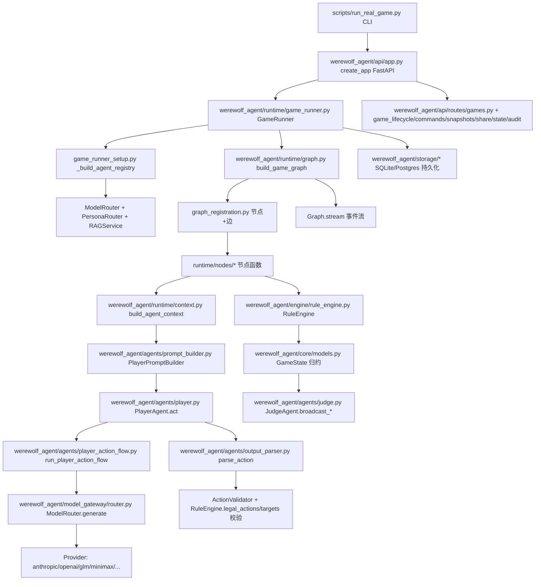

# 狼人杀多智能体项目小白指南 v1.1.4

> **项目路径**：`E:\NLP\agent\wofkill`
> **生成时间**：2026-07-14
> **适用 commit**：`27cc0ed`（commit message: `fix: close three-game audit acceptance gaps`，由 `git log -1 27cc0ed` 确认）。该 commit 即 `master` HEAD，无更晚 commit。
> **适用对象**：Python 零基础新人；目标是用 1 份指南理解 V1 狼人杀 12 人板型的整套工程
> **文档原则**：一切以代码事实为真相源，CLAUDE.md / PROGRESS.md / design v1 文档 / commit message 仅作上下文说明。**PROGRESS.md 等进度台账只记 phase 大事，许多迭代优化没记录在进度文档中，文档不可倒推为"该优化已被记录"。**

---

## 0. 阅读约定

- **本指南基于 2026-07-14 仓库状态，master HEAD = `27cc0ed`（`fix: close three-game audit acceptance gaps`）。** PROGRESS.md 头部仅声明 `Current phase: srp-file-splitting`，**未直接提及 `27cc0ed` 或 "three-game audit" 字样**——本指南的事实来源是 `git log` + 真实代码，PROGRESS.md 仅作 phase 大事台账参考。
- **本指南事实核对方法**（v1.1.4 起强调）：
  - 数量类（节点数 / 字段数 / ActionType 值数） → `grep` 或 `ls | wc -l` 在 HEAD 代码上直接验证
  - 行为类（女巫自救规则、LLM 不裁定） → 规则包 YAML + CLAUDE.md 关键字双重核对
  - 不可倒推："该优化已在 PROGRESS.md 出现" → **NO**，PROGRESS.md 只记 phase 大事
- **真实启动入口不止一个**：
  - `scripts/run_real_game.py`（CLI 跑真实 LLM 一局；最常用）
  - `werewolf_agent/api/app.py::create_app`（FastAPI 服务）
  - 测试入口（`tests/integration/test_live_runtime.py` 等）
- **V1 真相源顺序**（CLAUDE.md 顶级规则）：
  1. `docs/design/werewolf-agent-v1-design.md` §3
  2. `config/rulesets/pre_witch_hunter_idiot_mixed.yaml`
  3. `RuleEngine` 单元测试
- **新手专业术语速查**：
  - [类] = class；[对象/实例] = object/instance
  - [继承] = inheritance；[基类] = base class
  - [方法] = method；[属性] = field/attribute
  - [参数] = parameter；[返回值] = return value
  - [状态] = state；[回调] = callback
  - [路由] = routing；[节点] = node；[边] = edge；[条件边] = conditional edge
  - [Prompt] = 提示词；[System Message] = system prompt；[User Message] = user message
  - [Tool Call] = 工具调用；[Structured Output] = 结构化输出
  - [Agent] = 智能体；[StateGraph] = LangGraph 状态图

---

## 1. 项目一句话说明

本项目是一个由 **LangGraph 状态图**驱动、用 **LLM** 模拟 12 名玩家狼人杀对局的"实验场"工程；玩家由 `PlayerAgent`（LLM 决策）模拟，法官由 `JudgeAgent`（流程播报）模拟，所有身份、动作、胜负、死亡等"游戏真相"都由确定性 `RuleEngine` 结算；引擎外不会修改任何身份状态。一局游戏由 `GameRunner` 串行驱动，事件流由 `GameEvent`/`GameState` 归约，状态可重放。

---

## 2. 项目总体架构（Mermaid）



---

## 3. 项目目录和文件阅读台账

> 关键文件清单（按重要度排序；台账只列对理解项目必要的文件，完整目录树见仓库根 `git ls-files`）

| 文件路径 | 所属模块 | 主要作用 | 重要度 |
| --- | --- | --- | --- |
| `CLAUDE.md` | 项目 | 开发与协作规则 | 关键 |
| `PROGRESS.md` | 项目 | 当前 phase、风险 | 关键 |
| `docs/design/werewolf-agent-v1-design.md` | 设计 | 12 人规则包、LLM 边界、图节点 | 关键 |
| `harness/plans/2026-07-05-srp-file-splitting.md` | 计划 | SRP 拆分完成情况 | 高 |
| `harness/context/rule-authority.md` | 协作 | 规则权威顺序 | 高 |
| `config/rulesets/pre_witch_hunter_idiot_mixed.yaml` | 配置 | V1 唯一规则包 | 关键 |
| `config/personas/jingcheng_style_prototypes.yaml` | 配置 | 12 玩家人格 | 高 |
| `config/models.yaml` | 配置 | 每玩家模型绑定 | 高 |
| `config/auth.yaml` | 配置 | API 鉴权 | 中 |
| `config/rag_seeds/*.yaml` | 配置 | RAG 种子 | 中 |
| `werewolf_agent/core/models.py` | 核心数据 | `GameState`/`GameEvent`/`Action` 等 | 关键 |
| `werewolf_agent/engine/rule_engine.py` | 规则 | `RuleEngine` 总入口 | 关键 |
| `werewolf_agent/engine/rule_*.py` (9 个) | 规则 | flow/vote/exile/death/night/special_roles/victory/visibility/last_words | 高 |
| `werewolf_agent/engine/event_reducer.py` | 规则 | `EventReducer.reduce_event` | 高 |
| `werewolf_agent/engine/sheriff.py` | 规则 | `SheriffRules` | 高 |
| `werewolf_agent/engine/ruleset_loader.py` | 规则 | YAML 加载 | 高 |
| `werewolf_agent/runtime/graph.py` | 运行时 | `build_game_graph` / setup_game / assign_roles / route_* | 关键 |
| `werewolf_agent/runtime/graph_registration.py` | 运行时 | **37 节点** + 全部固定/条件边 | 关键 |
| `werewolf_agent/runtime/nodes/runtime_state.py` | 运行时 | `RuntimeState` TypedDict **50 字段** | 关键 |
| `werewolf_agent/runtime/game_runner.py` | 运行时 | `GameRunner` 3 mixin facade | 关键 |
| `werewolf_agent/runtime/game_runner_config.py` | 运行时 | `GameRunnerConfig` | 高 |
| `werewolf_agent/runtime/game_runner_setup.py` | 运行时 | `GameRunnerSetupMixin` | 高 |
| `werewolf_agent/runtime/game_runner_execution.py` | 运行时 | `GameRunnerExecutionMixin` | 高 |
| `werewolf_agent/runtime/game_runner_memory.py` | 运行时 | `GameRunnerMemoryMixin` | 中 |
| `werewolf_agent/runtime/context.py` | 上下文 | `build_agent_context` 编排 | 关键 |
| `werewolf_agent/runtime/context_*.py` (8 个) | 上下文 | persona/rag/memory_hints/skill_advice/strategy_directives/action_trace/cross_game_memory/role_directives/public_summary | 高 |
| `werewolf_agent/runtime/private_memory.py` | 上下文 | 私有记忆（兼容 facade） | 中 |
| `werewolf_agent/runtime/visible_state.py` | 上下文 | 可见世界状态 + 复盘摘要 | 中 |
| `werewolf_agent/runtime/executor.py` | 运行时 | `LocalRuntimeExecutor` 步进锁 | 中 |
| `werewolf_agent/runtime/redis_executor.py` | 运行时 | Redis 步进锁 | 中 |
| `werewolf_agent/runtime/replay.py` | 运行时 | 状态重放 | 中 |
| `werewolf_agent/runtime/timeline.py` | 运行时 | 时间线 | 中 |
| `werewolf_agent/runtime/checkpoints.py` | 运行时 | 检查点 | 中 |
| `werewolf_agent/runtime/cognition_state.py` | 运行时 | 认知状态（cross-game cognition） | 中 |
| `werewolf_agent/runtime/exposure_audit.py` | 运行时 | 暴露审计 | 中 |
| `werewolf_agent/runtime/world_model_audit.py` | 运行时 | 世界模型审计 | 中 |
| `werewolf_agent/runtime/sheriff_policy.py` | 运行时 | 警徽策略 | 中 |
| `werewolf_agent/runtime/seer_claim_validator.py` | 运行时 | 预言家声称验证 | 中 |
| `werewolf_agent/runtime/nodes/_shared.py` | 节点 | 节点共享 helper（不注册为节点） | 中 |
| `werewolf_agent/runtime/nodes/runtime_state.py` | 节点 | `RuntimeState` 类型（不注册为节点） | 关键 |
| `werewolf_agent/runtime/nodes/action_audit.py` | 节点 | 动作审计（不注册为节点） | 中 |
| `werewolf_agent/runtime/nodes/node_helpers.py` | 节点 | 节点 helper | 中 |
| `werewolf_agent/runtime/nodes/judge_broadcast_helpers.py` | 节点 | 法官广播事件构造 | 中 |
| `werewolf_agent/runtime/nodes/night.py` | 节点 | 夜间节点 facade | 高 |
| `werewolf_agent/runtime/nodes/night_entry.py` | 节点 | `enter_night`/`night_hunter_idiot_status` | 高 |
| `werewolf_agent/runtime/nodes/night_specialists.py` | 节点 | `night_witch`/`night_seer`/`first_night_hybrid_master` facade | 高 |
| `werewolf_agent/runtime/nodes/night_witch_node.py` | 节点 | `night_witch` 实现 | 高 |
| `werewolf_agent/runtime/nodes/night_resolution.py` | 节点 | `resolve_night` | 高 |
| `werewolf_agent/runtime/nodes/wolf_night_nodes.py` | 节点 | 狼夜节点 facade | 高 |
| `werewolf_agent/runtime/nodes/wolf_discussion.py` | 节点 | 狼讨论 | 中 |
| `werewolf_agent/runtime/nodes/wolf_consensus.py` | 节点 | 狼共识 | 中 |
| `werewolf_agent/runtime/nodes/day.py` | 节点 | 日间节点 facade | 高 |
| `werewolf_agent/runtime/nodes/day_deaths.py` | 节点 | 死亡/遗言 | 中 |
| `werewolf_agent/runtime/nodes/day_discussion.py` | 节点 | 自由讨论 | 中 |
| `werewolf_agent/runtime/nodes/day_vote.py` | 节点 | 投票/放逐 | 中 |
| `werewolf_agent/runtime/nodes/day_finish.py` | 节点 | `check_victory`/`finish_game` | 中 |
| `werewolf_agent/runtime/nodes/sheriff.py` | 节点 | 警长节点 facade | 中 |
| `werewolf_agent/runtime/nodes/sheriff_registration.py` | 节点 | 警长报名 | 中 |
| `werewolf_agent/runtime/nodes/sheriff_speech.py` | 节点 | 警长发言 | 中 |
| `werewolf_agent/runtime/nodes/sheriff_vote.py` | 节点 | 警长投票 | 中 |
| `werewolf_agent/runtime/nodes/sheriff_endorse.py` | 节点 | 警长归票 | 中 |
| `werewolf_agent/runtime/nodes/sheriff_pk.py` | 节点 | 警长 PK | 中 |
| `werewolf_agent/runtime/nodes/skills.py` | 节点 | 猎人开枪/警徽移交/狼自爆 | 中 |
| `werewolf_agent/runtime/nodes/summary.py` | 节点 | `summarize_context`/`summarize_positions`/`reflection` | 中 |
| `werewolf_agent/runtime/directives/*` (7 个) | 策略指令 | 角色战术指令 | 中 |
| `werewolf_agent/runtime/strategy/*` (7 个) | 策略 | 死亡/女巫/混血儿/猎人/毒药/毒杀/狼夜 | 中 |
| `werewolf_agent/agents/schemas.py` | 智能体 | `ActionType`/`PlayerAction` Union + 16 子类 | 关键 |
| `werewolf_agent/agents/action_schemas.py` | 智能体 | 真实定义 | 关键 |
| `werewolf_agent/agents/action_validation.py` | 智能体 | `DefaultActionValidator` | 高 |
| `werewolf_agent/agents/player.py` | 智能体 | `PlayerAgent.act` facade | 关键 |
| `werewolf_agent/agents/player_action_flow.py` | 智能体 | `run_player_action_flow` | 关键 |
| `werewolf_agent/agents/player_action_result.py` | 智能体 | action 成功/fallback 结果 | 高 |
| `werewolf_agent/agents/player_generation.py` | 智能体 | 模型调用 | 中 |
| `werewolf_agent/agents/player_generation_request.py` | 智能体 | provider 请求构建 | 中 |
| `werewolf_agent/agents/player_retry.py` | 智能体 | 重试/降级 | 中 |
| `werewolf_agent/agents/player_retry_hints.py` | 智能体 | 重试提示 | 中 |
| `werewolf_agent/agents/player_quality_retries.py` | 智能体 | quality retry | 中 |
| `werewolf_agent/agents/player_persona.py` | 智能体 | persona snapshot | 中 |
| `werewolf_agent/agents/player_fallback_speech.py` | 智能体 | fallback 发言 | 中 |
| `werewolf_agent/agents/player_failures.py` | 智能体 | 失败分类 | 中 |
| `werewolf_agent/agents/player_latency.py` | 智能体 | 延迟 | 中 |
| `werewolf_agent/agents/output_parser.py` | 智能体 | `parse_action` facade | 高 |
| `werewolf_agent/agents/action_data_extraction.py` | 智能体 | JSON 提取 | 中 |
| `werewolf_agent/agents/action_normalization.py` | 智能体 | 字段归一 | 中 |
| `werewolf_agent/agents/action_repair.py` | 智能体 | JSON 修复 | 中 |
| `werewolf_agent/agents/speech_intent_parser.py` | 智能体 | 发言意图 | 中 |
| `werewolf_agent/agents/choice_pipeline.py` | 智能体 | choice pipeline | 中 |
| `werewolf_agent/agents/json_repair.py` | 智能体 | JSON 修复工具 | 中 |
| `werewolf_agent/agents/tool_schema.py` | 智能体 | tool schema 构造 | 中 |
| `werewolf_agent/agents/speech_quality.py` | 智能体 | 发言质量 | 中 |
| `werewolf_agent/agents/vote_quality.py` | 智能体 | 投票质量 | 中 |
| `werewolf_agent/agents/prompt_builder.py` | 智能体 | `PlayerPromptBuilder` facade | 关键 |
| `werewolf_agent/agents/prompt_composer.py` | 智能体 | 组合 system/user | 高 |
| `werewolf_agent/agents/prompt_sections.py` | 智能体 | `_SectionSpec` | 中 |
| `werewolf_agent/agents/prompt_system.py` | 智能体 | system 段 | 高 |
| `werewolf_agent/agents/prompt_user_context.py` | 智能体 | user 段 | 高 |
| `werewolf_agent/agents/prompt_persona.py` | 智能体 | persona 段 | 中 |
| `werewolf_agent/agents/prompt_memory.py` | 智能体 | memory 段 | 中 |
| `werewolf_agent/agents/prompt_strategy.py` | 智能体 | strategy 段 | 中 |
| `werewolf_agent/agents/prompt_salience.py` | 智能体 | salience 段 | 中 |
| `werewolf_agent/agents/prompt_output.py` | 智能体 | output 协议 | 中 |
| `werewolf_agent/agents/prompt_rag_memory.py` | 智能体 | RAG 渲染 | 中 |
| `werewolf_agent/agents/prompt_choice.py` | 智能体 | choice prompt | 中 |
| `werewolf_agent/agents/prompt_formatting.py` | 智能体 | 通用格式化 | 中 |
| `werewolf_agent/agents/directive_priority.py` | 智能体 | 指令优先级常量 | 中 |
| `werewolf_agent/agents/judge.py` | 智能体 | `JudgeAgent` facade | 关键 |
| `werewolf_agent/agents/judge_persona.py` | 法官 | 法官 persona | 中 |
| `werewolf_agent/agents/judge_static_broadcasts.py` | 法官 | 阶段/死亡纯模板 | 中 |
| `werewolf_agent/agents/judge_dynamic_broadcasts.py` | 法官 | LLM 动态播报 | 中 |
| `werewolf_agent/agents/judge_hitl.py` | 法官 | HITL facade | 中 |
| `werewolf_agent/agents/judge_hitl_commands.py` | 法官 | HITL 命令 | 中 |
| `werewolf_agent/agents/judge_hitl_guards.py` | 法官 | HITL 守卫 | 中 |
| `werewolf_agent/agents/metrics_collector.py` | 智能体 | 玩家失败画像 | 中 |
| `werewolf_agent/agents/parse_dispatch.py` | 智能体 | 输出模式调度 | 中 |
| `werewolf_agent/agents/trace_schemas.py` | 智能体 | decision trace | 中 |
| `werewolf_agent/agents/trace_builder.py` | 智能体 | trace 构建 | 中 |
| `werewolf_agent/agents/planning.py` | 智能体 | planning 协议 | 中 |
| `werewolf_agent/agents/semantic_repair_audit.py` | 智能体 | 语义修复审计 | 中 |
| `werewolf_agent/agents/wolf_team_plan_schema.py` | 智能体 | 狼队 plan schema | 中 |
| `werewolf_agent/cognition/world_state.py` | 认知 | `build_world_state` | 关键 |
| `werewolf_agent/cognition/visibility.py` | 认知 | `VisibilityPolicy` | 关键 |
| `werewolf_agent/cognition/{contradiction,belief,claim_credibility,worlds,simulator,role_monitor,public_evidence}.py` | 认知 | 7 个认知引擎（含 visibility.py 与 world_state.py 合计 9 个认知模块；前两行已单列 `build_world_state` / `VisibilityPolicy`） | 高 |
| `werewolf_agent/model_gateway/router.py` | 模型 | `ModelRouter` facade | 关键 |
| `werewolf_agent/model_gateway/{router_config,router_selection,router_errors,router_probe,structured_output,retry_policy,reasoning_policy,usage_records,execution_records,final_prompt_observer,providers/*}.py` | 模型 | 10+ 子模块 | 高 |
| `werewolf_agent/persona_runtime/{router,judge_router,policy}.py` | 人格 | 玩家/法官 router | 高 |
| `werewolf_agent/memory/{store,reflection,reflection_*,schemas,cognition_matrix,relation_graph,profile,migration,persistence,vector_index,review}.py` | 记忆 | 12 个模块 | 高 |
| `werewolf_agent/rag/{knowledge_service,retriever,retrieval_ranking,query_processing,vector_store,local_vector_store,embedding_vector_store,ingestion,prompt_renderer,reranker_client,embedding_client,tactical_text,seed_data,injector,persistence,evaluation}.py` | RAG | 16 个模块 | 高 |
| `werewolf_agent/skills/{werewolf_skills,registry,manifest_loader,skill_handler_registry,good_claim_handlers,good_vote_handlers,good_power_handlers,wolf_skill_handlers,review_skill_handlers,advice_frames,skill_context,schemas}.py` | 技能 | 12 个模块 | 高 |
| `werewolf_agent/tools/{local_tools,local_tool_memory,mcp_registry,mcp_transport,tool_logger,schemas}.py` | 工具 | 6 个模块 | 中 |
| `werewolf_agent/evaluation/{metrics,metric_*,feedback_*,balance_*,attribution,llm_judge,regression_gate,candidates,candidate_*,full_game_ablation,replay,reports,schemas,trace_*,text_similarity,langsmith_exporter,world_*,decision_*,diagnostics,acceptance_*}.py` | 评测 | 25+ 模块 | 高 |
| `werewolf_agent/storage/{repository,sqlite_store,postgres_store,memory_store,persistent_memory,migrations,production}.py` | 存储 | 7 个模块 | 高 |
| `werewolf_agent/api/{app,auth,permissions,schemas,views}.py` | API | 5 个模块 | 高 |
| `werewolf_agent/api/routes/{games,game_lifecycle,game_commands,game_snapshots,game_snapshot_*,game_cognition_views,game_public_share,game_persistence,game_auth,customization}.py` | API | 11 个模块 | 高 |
| `werewolf_agent/customization/{ruleset_registry,compatibility,schemas,repository,persona_adapter,validators,preview}.py` | 自定义 | 7 个模块 | 高 |
| `werewolf_agent/ui/static/{dashboard.html,dashboard.css,dashboard.js}` | UI | 观战台 | 中 |
| `scripts/run_real_game.py` | 入口 | 真实 LLM 一局 | 关键 |
| `scripts/run_real_game_reports.py` | 报告 | | 中 |
| `scripts/{print_game_audit,analyze_recent_balance,analyze_reflection_score,clear_memory,migrate_reflection_memory_v2,offline_belief_worlds_compare,evaluate_audit_closure_thresholds,probe_ark_tool_support,probe_real_game_baidu_action,verify_ark_text_json,run_audit_closure_soak.ps1}.py` | 工具 | 11 个 | 中 |
| `tests/conftest.py` | 测试 | 公共 fixture | 高 |
| `tests/runtime/` | 测试 | **86 个**测试文件 | 高 |
| `tests/agents/` | 测试 | **42 个**测试文件 | 高 |
| `tests/{rules,cognition,skills,memory,rag,evaluation,integration,storage,tools,ui,model_gateway,persona_runtime,customization,scripts,api,core}/*.py` | 测试 | 子目录 | 高 |
| `environment.yml`, `Dockerfile`, `docker-compose.yml`, `.env.example` | 部署 | Conda/Docker | 中 |
| `docs/{design,development,operations,superpowers,audit}/*` | 文档 | 设计/计划/审计 | 中 |
| `harness/{checklists,templates}/*` | 协作 | 检查单/模板 | 中 |
| `pytest.ini` | 测试 | pytest 配置 | 中 |

---

## 4. 功能模块划分

### 4.1 核心数据 `werewolf_agent.core`

- **职责**：所有不可变游戏状态数据；零外部依赖。
- **核心类**（`models.py`）：
  - `PlayerState`（id/role/alive/revealed_idiot/vote_enabled/badge_eligible/exile_immune/faction）
  - `Death`（player_id/reason/timing/resolution_batch/source_player_id/can_leave_last_words/triggered_skills）
  - `GameState`（**23 字段**）：`ruleset_id, players, game_id, phase, day_number, night_number, hybrid_master_id, hybrid_master_faction, hybrid_result, sheriff_id, sheriff_badge_state, sheriff_candidates, sheriff_interrupt_count, sheriff_tie_count, sheriff_pk_candidates, votes, private_intents, antidote_used, poison_used, deaths, events, winning_faction, paused`
  - `Action`（`type: str, target_id: str|None`）— RuleEngine 内部用，**与 LLM `PlayerAction` 不同类**
  - `RuleResult`（accepted, error_code）
  - `AlignmentResult`（alignment, role）
  - `VictoryResult`（winner, reason）
  - `BadgeDecisionOptions`（can_transfer, can_tear, transfer_targets）
  - `VoteResult`（exiled_player_id, next_phase, reason, tied_player_ids）
  - `GameEvent`（type, payload）
  - `VisibleContext`（view_mode, visible_sections）
- **新手类比**：`GameState` 是一局游戏的"棋盘"，只能 `replace(state, x=y)` 返回新棋盘。`Action` 是 RuleEngine 内部纯数据；`PlayerAction` 是 LLM 输出的 Pydantic schema。

### 4.2 规则引擎 `werewolf_agent.engine`

- **职责**：所有"游戏真相"判定：角色分配、合法动作、验人、狼杀、女巫、警徽、放逐、胜负、死亡、事件归约。
- **核心类**：`RuleEngine`（`rule_engine.py`）、`SheriffRules`（`sheriff.py`）、`EventReducer`（`event_reducer.py`）。
- **`RuleEngine` 公开方法**（按源码顺序）：
  1. `from_yaml(path)` 类方法
  2. `role_count(role)` / `night_order()` / `day_flow(day_number)` / `base_vote_weight()` / `sheriff_vote_weight()` / `vote_weight(state, voter_id)`（rule_engine.py:259）
  3. `check_alignment(state, *, target_id)` / `_apply_idiot_reveal(state, player_id)`
  4. `choose_master(state, *, hybrid_id, master_id)`
  5. `legal_witch_actions(state, *, witch_id, night_number, wolf_kill_target_id)` / `resolve_witch_action(state, *, witch_id, night_number, wolf_kill_target_id, use_antidote, poison_target_id, antidote_target_id=None)`
  6. `can_hunter_shoot(state, *, hunter_id, death_reason)` / `legal_exile_targets(state)` / `resolve_exile(state, *, target_id)` / `apply_death(state, death)`
  7. `resolve_night(state, *, night_number, wolf_kill_target_id, use_antidote=False, poison_target_id=None, seer_target_id=None)`
  8. `resolve_self_destruct(state, *, wolf_id, day_number)` / `check_victory(state)` / `resolve_vote(state, *, votes, revote, ...)`
  9. `badge_options_after_sheriff_death(...)` / `resolve_badge_decision(...)` / `sheriff_register(...)` / `sheriff_withdraw(...)` / `resolve_sheriff_vote(...)` / `speech_order_policy(state)`
  10. `can_leave_last_words(state, *, death_reason, timing, night_number)` / `build_visible_context(raw, state, *, viewer_id, view_mode)` / `record_private_intent(state, *, player_id, private_intent)`
  11. `reduce_event(state, event)` / `reduce_events(state, events)`
  12. `_validate_alive_target(state, target_id, label)`
- **依赖**：核心数据 + YAML 加载。
- **新手类比**：`RuleEngine` 是"裁判/会计"——所有结算都从它走；操作不可变（输入 `GameState`，输出新 `GameState` + `GameEvent[]`）。

### 4.3 智能体 `werewolf_agent.agents`

- **核心类**：
  - `PlayerAgent`（`player.py` facade；真实逻辑在 `player_action_flow.py:run_player_action_flow`）
  - `JudgeAgent`（`judge.py` facade，**7 个公开方法真实顺序**）：
    1. `broadcast_phase`（`judge.py:90`）— 纯模板
    2. `broadcast_death_announcement`（`:105`）— 纯模板
    3. `broadcast_vote_calling`（`:116`）— LLM
    4. `guide_skill_use`（`:143`）— LLM
    5. `announce_vote_tally`（`:166`）— LLM
    6. `announce_exile_result`（`:185`）— LLM
    7. `broadcast_sheriff_result`（`:204`）— LLM
  - `SimpleAgentRegistry`（`runtime/agent_registry.py`）
  - `PlayerPromptBuilder`（8 mixin：Section/Salience/Strategy/Persona/Memory/Output/System/UserContext）
  - `ActionType` enum（`action_schemas.py:24-40`，**16 值真实顺序**）：
    `NO_ACTION → VOTE → WOLF_KILL → WOLF_NO_KILL → USE_ANTIDOTE → USE_POISON → CHECK_ALIGNMENT → CHOOSE_MASTER → HUNTER_SHOT → SELF_DESTRUCT → SHERIFF_REGISTER → SHERIFF_WITHDRAW → SHERIFF_VOTE → BADGE_TRANSFER → BADGE_TEAR → SPEECH`
  - `PlayerAction` Union（`action_schemas.py:222-358`，**16 子类型**）：`VotePlayerAction, SpeechPlayerAction, WolfKillPlayerAction, CheckAlignmentPlayerAction, UsePoisonPlayerAction, ChooseMasterPlayerAction, HunterShotPlayerAction, BadgeTransferPlayerAction, SheriffVotePlayerAction, NoOpPlayerAction, WolfNoKillPlayerAction, UseAntidotePlayerAction, SelfDestructPlayerAction, SheriffRegisterPlayerAction, SheriffWithdrawPlayerAction, BadgeTearPlayerAction`
  - `FallbackAction`、`RetryInfo`、`AgentContext`、`JudgeBroadcast`
- **核心调用链**：
  ```
  PlayerAgent.act(context)
    → run_player_action_flow(agent, context)         # player_action_flow.py:72
      → PlayerPromptBuilder.build_system_prompt()  # prompt_builder.py:160
      → PlayerPromptBuilder.build_user_prompt(retry)  # prompt_builder.py:167
      → ModelRouter.generate(agent_id, task_type, prompt, system_prompt)
      → parse_action(raw_text)                       # output_parser.py:190
      → DefaultActionValidator.validate(...)         # action_validation.py:48
      → RetryInfo / FallbackAction
  ```

### 4.4 运行时 `werewolf_agent.runtime`

- **职责**：LangGraph 状态图编排、节点实现、上下文构建、跨局记忆/反思、策略指令、检查点、HITL、复盘。
- **核心**：
  - `GameRunner`（3 mixin）+ `GameRunnerConfig`
  - `build_game_graph()`（缓存单例 `_GAME_GRAPH_CACHE`，**37 节点**）
  - `RuntimeState` TypedDict（**50 字段**）
  - `build_agent_context(engine, gs, player_id, task_type, *, ...)` 编排 facade
  - 私有 action 拆分布局（多次 SRP 拆分后）：
    - `agent_special_actions.py` — 女巫/预言家/混血儿选主/警徽处置/猎人
    - `agent_day_actions.py` — facade
    - `agent_day_speech_actions.py` / `agent_day_vote_actions.py` — 发言/投票
    - `agent_sheriff_actions.py` — **只剩 helper**（`register/withdraw/_pick_speech_order/_endorse`），sheriff_vote/sheriff_withdraw 已迁到 `runtime/nodes/sheriff_vote.py` 和 `sheriff_registration.py`
    - 节点适配器 — `_dispatch_agent` → agent action pipeline
  - `_build_fallback_wolf_team_plan` 真实定义在 `werewolf_agent/runtime/nodes/wolf_discussion.py:253`（**直接函数**，不是 facade）
- 节点适配器 — `_dispatch_agent` → agent action pipeline
- **依赖**：规则引擎、模型网关、agent、人格、记忆。
- **新手类比**：`GameRunner` 是"游戏主持人按剧本走的指挥棒"；节点是剧本每一场戏；`build_agent_context` 是"装信封的人"；`route_*` 是"这场戏完了去哪儿"。

### 4.5 模型网关 `werewolf_agent.model_gateway`

- **职责**：唯一可调用大模型入口；provider 选择、retry、fallback、结构化输出、用量统计。
- **核心类**：`ModelRouter`（`router.py` facade）；子模块 10+。
- **核心方法**：`from_yaml(path, register_env_providers=True)`、`generate(agent_id, task_type, prompt, system_prompt, tools=None, ...)`、`resolve_structured_output_policy(...)`、`resolve_config(...)`、`provider_names()`。
- **依赖**：env（`ANTHROPIC_API_KEY/GLM_API_KEY/...`）、`config/models.yaml`。
- **新手类比**：`ModelRouter` 是"前台客服总机"。

### 4.6 认知协处理器 `werewolf_agent.cognition`

- **职责**：把状态转结构化事实；按身份裁剪可见性；矛盾检测；信念更新；可信度；可能世界；仿真；角色监控。
- **核心**：`build_world_state`、`VisibilityPolicy.filter_visible_facts`、`ContradictionEngine.detect`、`BeliefUpdater.update`、`SeerClaimCredibilityEngine`、`PossibleWorldsEngine.generate`、`BoundedSimulator.simulate`、`RoleStateMonitor`。
- **依赖**：核心数据、规则 raw。
- **新手类比**：LLM 的"事前思考"——不让 LLM 自己从长文本里找"哪些事件对我可见"。

### 4.7 上下文构建 `werewolf_agent.runtime.context*`

- **职责**：把 `GameState` + 玩家身份 + 反思 + 认知 + 技能 + 策略指令 + 公开事件，组装成 `AgentContext`。
- **核心函数**：`build_agent_context(engine, gs, player_id, task_type, *, legal_actions, legal_targets, wolf_kill_target_id, wolf_team_plan, rag_service, restored_memory, cognition_state_manager, discussion_positions, decision_identity, exposure_collector, decision_trace_sink) -> AgentContext`。
- **依赖**：认知协处理器全部、记忆/RAG/人格。

### 4.8 提示词构建 `werewolf_agent.agents.prompt_*`

- **核心类**：`PlayerPromptBuilder`（继承 8 mixin）。
- **系统 prompt 8 段**（`compose_system_prompt` 真实顺序）：
  1. `_build_core_identity()` → `"你是 {own_role}。本局 {ruleset_id}。"`
  2. `_build_persona()`（persona 必须在 system 固定位）
  3. `_build_game_rules()`
  4. `_build_role_guide()`（按 own_role）
  5. `_build_information_boundaries()`
  6. `_build_reasoning_method()`
  7. `_build_skill_policy()`
  8. `_build_output_contract()`
- **用户 prompt 15 段**（`compose_user_prompt` 真实顺序；含 `_build_task_prompt`）：
  ```
  === DYNAMIC_BOUNDARY ===
  [phase_context] [public_summary] [visible_state] [salience_events]
  [recent_transcript] [belief_state] [contradiction_alerts]
  [seer_credibility] [possible_worlds] [simulation_predictions]
  [private_memory_hints] [learning_context] [strategy_directive]
  [task_prompt]                    # compose_user_prompt:107 (v1.1.4 补漏)
  [final_output_guard]
  ```
- **预算裁剪**：`_enforce_budget(parts)` → `_USER_PROMPT_BUDGET_CHARS = 20000`；裁剪顺序：辅助 → 参考 → 必选（永不裁 `strategy_directive` / `retry_hint` / `output_contract`）。

### 4.9 反思记忆 `werewolf_agent.memory`

- **核心类**：`ReflectionMemory`（PostgreSQL 持久）、`ReflectionSynthesizer`（按角色族模板合成 LLM self-review + 确定性 review）、`ReflectionQualityGate`（按 PLUS/MINUS 评分 ≥0.70 = approved）、`RelationGraph`、`CognitionMatrix`。
- **核心函数**：`synthesize(llm_self_review, review_report, faction)` → `ReflectionEntryV2`；`evaluate(entry)` → `ReflectionQualityGated`。
- **依赖**：PostgreSQL 持久化。

### 4.10 RAG `werewolf_agent.rag`

- **职责**：基于规则包/技能/历史对局，提供"怎么打"的建议检索；不解释规则。
- **核心类**：`RAGKnowledgeService`（主入口）、`StrategyRetriever`（facade）、`EmbeddingVectorStore`/`PgVectorStore`/`SiliconFlowVectorStore`、`SiliconFlowRerankerClient`。
- **核心函数**：`ensure_seeded()`、`query(Query)` → 4 道防线硬过滤 + `List[RAGEntry]`、`hits_to_prompt_lines(hits, ...)`、`inject(context, ...)`。
- **4 道防线**（`ingestion.py:90-245` 真实实现；line 90 是 `_validate_forbidden_content` 起点，line 9-86 仅是 helper）：
  1. **Schema 封闭**：`RAGEntry` 字段不包含 `private_intent`/`wolf_team`/`seer_result` 等
  2. **Ingestion 校验**：禁止 4 类 forbidden keyword（"pNN 是狼"等）
  3. **基础规则正则**：16 个 pattern 拒绝
  4. **PII 过滤**：`\bp\d{2}\b` 拒绝 PII + catch-all（"pNN is <role>" / "pNN 查杀"）

### 4.11 技能 `werewolf_agent.skills`

- **职责**：狼人杀战术拆成可注册 skill，每个 handler 由 `_register_handler` 注册；`apply_skill` 注入建议帧。
- **核心**：`apply_skill(gs, player_id, skill_name, ...)` → `(advice_frame, call_record)`；handlers：`bold_claim / counter_claim / push_vote / swing_vote / find_power / protect_power / resist_push / last_words / deep_hook / hide_identity / wolf_pit / review_correction`。

### 4.12 API `werewolf_agent.api`

- **核心类**：`AuthManager`、`PermissionChecker`。
- **真实路由**（由 `create_app()` 装载）：
  - `POST /games`（create_game）
  - `GET /games`（list_games，moderator/debugger only）
  - `POST /games/{game_id}/start`（start_game）
  - `POST /games/{game_id}/step`（step_game）
  - `POST /games/{game_id}/pause`（pause_game）
  - `POST /games/{game_id}/resume`（resume_game）
  - `GET /games/{game_id}/public-state`（公开状态）
  - `GET /games/{game_id}/players/{player_id}/private-state`（玩家私有状态）
  - `GET /games/{game_id}/timeline`（时间线）
  - `GET /games/{game_id}/replay`（回放）
  - `GET /games/{game_id}/share-summary`（公开分享摘要）
  - `GET /games/{game_id}/rag-audit`（RAG 注入审计，moderator only）
  - `GET /games/{game_id}/world-model-audit`（世界模型审计）
  - `GET /games/{game_id}/cognition-diff`（认知差异）
  - `POST /games/{game_id}/judge-command`（HITL 命令，moderator only）
  - 各种 `/_customization/...`

### 4.13 存储 `werewolf_agent.storage`

- **核心**：`GameRepository` 协议 + SQLite/Postgres 实现 + 跨局持久记忆。
- **核心函数**：`save_game(state)`、`load_game(game_id)`、`save_config_snapshot(game_id, snapshot)`、`save_rag_entries()`、`save_custom_config(record)`。

### 4.14 评测 `werewolf_agent.evaluation`

- **核心类**：`MetricsAggregator`（facade）、`AttributionEngine`（`AttributionTextResolver` + `cited/aligned/harmful/beneficial`）、`MetricsAggregator` 真实方法包括 `compute_*` outcome + quality（拆分到 `metric_outcomes.py` / `metric_quality.py`）、`BalanceAudit`、`LLMJudge`、`RegressionGate`、`CandidateStore` / `CandidateMaterializer` / `RepositoryCandidateStore`。
- **新手类比**：评测是"赛后记者"，把游戏产物拆成胜负、发言质量、决策归因、反思评分。

### 4.15 自定义 `werewolf_agent.customization`

- **职责**：规则包/人格/玩家包的市场、兼容性矩阵、校验、预览。
- **核心类**：`RulesetRegistry`、`RulesetRegistryEntry`、`CompatibilityMatrix`、`InMemoryCustomizationRepository`。

---

## 5. 项目启动过程

| # | 启动项 | 命令/函数 | 配置来源 |
| - | - | - | - |
| 1 | 真实 LLM 一局 | `python scripts/run_real_game.py [--seed N --max-steps 500 --delay 0]` | `.env`（`ANTHROPIC_API_KEY` 或 `GLM_API_KEY`、`ANTHROPIC_BASE_URL`、`WEREWOLF_USE_LLM_AGENTS=1`、`WEREWOLF_MODEL_CONFIG=config/models.yaml`）+ CLI |
| 2 | 启动后端 + 写回 repo | `scripts/run_real_game.py` 内部 30s 启 `docker compose up -d postgres`（失败时降级到 SQLite/内存） | `WOFKILL_PG_DSN`、`WEREWOLF_STORAGE_BACKEND`、`WEREWILL_DB_PATH` |
| 3 | 构造 `GameRunnerConfig` | `_build_runner_config(args, game_repo, memory_coordinator)` | 固定 `ruleset_id="pre_witch_hunter_idiot_mixed"`、`player_count=12`、`persona_config_path=config/personas/jingcheng_style_prototypes.yaml` |
| 4 | 构造 `GameRunner` | `GameRunner(config)` → `RuleEngine.from_yaml(ruleset_path)` + `build_game_graph()` + `_build_agent_registry()`（12 PlayerAgent）+ `JudgeAgent` | |
| 5 | 跑一局 | `runner.run(max_steps=500)` → `self._graph.stream(initial, {"recursion_limit": 500})` | 50 步同 (phase, day, night) → 强制 finish |
| 6 | 落盘 + 报告 | `save_game_log` / `print_game_summary` / `print_usage_stats` / `print_pace_report` / `print_quality_audit` / `check_leakage` | `fallback_rate > 0.7` 落 `low_quality_games/` |
| 7 | 启动 FastAPI | `app = create_app(repository=..., auth_manager=...)` / `uvicorn werewolf_agent.api.app:app` | env 控制 CORS、存储、RAG |
| 8 | 启动测试 | `python -m pytest -n 0 --basetemp .pytest_tmp/<id> tests/...` | 本机推荐 `-o addopts=""` 串行 + basetemp |

---

## 6. 一局狼人杀的完整代码流程

> 每步附"玩家看到什么 / 代码内部发生什么"对照；状态变化以 `GameState` 字段为锚点。

### 步骤 0：CLI 启动到 `GameRunner.run()`

| 项目 | 内容 |
| - | - |
| 文件 | `scripts/run_real_game.py::main` → `GameRunner.__init__` → `GameRunnerExecutionMixin.run` |
| 输入 | `--seed 42 --max-steps 500 --delay 0`、`.env` |
| 状态 | `runner._state = GameState(game_id="g_<seed>", ruleset_id="pre_witch_hunter_idiot_mixed", phase="setup")`；`runner._engine` 加载 12 人规则 |
| 新手解释 | "开局前"：CLI 读取配置 → 创建 12 玩家 1 法官 → 加载游戏图 → 开始 stream |

### 步骤 1：`setup_game` 节点

| 项目 | 内容 |
| - | - |
| 文件 | `graph.py::setup_game` |
| 上游 | 入口 `setup_game` |
| 核心 | `_ensure_runtime_audit_state`；`_new_engine()`；`gs.phase = "setup"`；`_judge_broadcast(phase="game_start")` |
| 状态 | `gs.phase = "setup"` + events += [judge_broadcast(game_start)] |
| 下游 | `assign_roles` |
| 玩家看到 | 法官文字 "游戏开始，请所有玩家确认身份" |

### 步骤 2：`assign_roles` 节点

| 项目 | 内容 |
| - | - |
| 文件 | `graph.py::assign_roles` |
| 核心 | `engine.assign_roles(player_ids, seed=_stable_seed(gs.game_id, "roles"))` → `rule_flow.assign_roles` 随机分配 4 狼/3 民/预言家/女巫/猎人/白痴/混血儿 |
| 状态 | `gs.players = {...12}`、`gs.phase = "roles_assigned"`、events += [roles_assigned] |
| 玩家看到 | 自己的身份卡（不发别人身份） |

### 步骤 3：`enter_night` → `wolf_discussion` → `wolf_team_plan` → `wolf_consensus`

| 项目 | 内容 |
| - | - |
| 文件 | `night_entry.py::enter_night` → `wolf_discussion.py::wolf_discussion` → `wolf_night_nodes.py::wolf_team_plan_node` → `wolf_consensus.py::wolf_consensus` |
| 核心 | (1) `enter_night` phase=night；(2) 4 狼轮流 LLM 发言；(3) 首狼 Pydantic `WolfTeamPlan`（fake_seer/pusher/hooker/deep_cover + 击杀目标主备 + public_story + reasoning；`reasoning` 仅狼队可见；LLM 失败回退到 `_build_fallback_wolf_team_plan`，emit `wolf_team_plan_fallback` 审计）；(4) 4 狼依据结构化立场达成一致或安全空刀 |
| 状态 | `state["wolf_kill_target_id"]` 写入；`state["wolf_team_plan"]` 私有 |
| 玩家看到 | 4 狼闭眼讨论；其他 8 人闭眼 |

### 步骤 4：`night_witch` → `night_seer` → `night_hunter_idiot_status` → `first_night_hybrid_master`

| 项目 | 内容 |
| - | - |
| 文件 | `night_witch_node.py::night_witch` → `night_specialists.py::night_seer` → `night_entry.py::night_hunter_idiot_status` → `night_specialists.py::first_night_hybrid_master` |
| 核心 | (1) `night_witch`：仅当 `wolf_action == "kill"` 时女巫可选择 `use_antidote` 或 `use_poison`；**女巫全程不能自救，包括首夜**（`pre_witch_hunter_idiot_mixed.yaml:83` 显式 `can_self_save: false` + `can_self_save_first_night: false`，与 `CLAUDE.md:74` + `rule_special_roles.py:81-83` 一致）。(2) `night_seer`：预言家选 target，`engine.check_alignment` → 仅 good/werewolf，结果入 `state["seer_action_trace"]` 私有。(3) 首夜身份确认播报。(4) 混血儿选 master，`engine.choose_master` |
| 状态 | `state["use_antidote"]` / `state["poison_target_id"]` / `state["seer_action_trace"]` / `state["hybrid_master_target_id"]` 私有 |
| 玩家看到 | 闭眼 |

### 步骤 5：`resolve_night_node`（夜间结算）

| 项目 | 内容 |
| - | - |
| 文件 | `night_resolution.py::resolve_night` |
| 核心 | `engine.resolve_night(state, ...)` → `rule_night.resolve_night` 顺序：女巫解药（`resolve_witch_action` 严格校验：女巫不能自救 / 不能同时用两瓶 / 当晚只能生效一次）→ 狼杀结算（如果女巫救了，则 wolf_kill 被救）→ 预言家验人（只入预言家 trace）→ `apply_death`（`can_leave_last_words` + `can_hunter_shoot`） |
| 状态 | `gs.deaths` += [Death(...)]；`gs.players[*].alive` 变更 |
| 下游 | `route_after_resolve_night` 条件路由到 `resolve_hunter_shot / reflection / sheriff_badge_transfer / sheriff_first_day_entry / announce_deaths / announce_deaths_with_badge_loss` |
| 玩家看到 | 仍闭眼（结算后才公告） |

### 步骤 6：`announce_deaths` / `night_death_last_words`

| 项目 | 内容 |
| - | - |
| 文件 | `day_deaths.py::announce_deaths`、`announce_deaths_with_badge_loss`、`night_death_last_words` |
| 核心 | (1) `announce_deaths`（首夜 N1 仍有遗言，否则 `can_leave_last_words` 校验）→ `_judge_broadcast(phase="night_death", deaths=...)`；(2) 若警长本批次死亡且 `BadgeDecisionOptions.can_transfer/can_tear`，路由到 `sheriff_badge_transfer`；(3) `night_death_last_words`：`engine.can_leave_last_words` 判定，玩家 LLM 写遗言 |
| 状态 | events += [judge_broadcast(night_death), last_words]；警徽可能变更 |
| 玩家看到 | "昨夜 p07 死亡" |

### 步骤 7：D1 警长竞选或 D2+ 跳过

| 项目 | 内容 |
| - | - |
| 文件 | `sheriff.py::sheriff_first_day_entry`、`sheriff_registration.py::sheriff_registration`、`sheriff_speech.py::sheriff_speech`、`sheriff_vote.py::sheriff_vote`/`sheriff_withdraw`、`sheriff_pk.py::sheriff_pk_speech`/`sheriff_revote`、`sheriff_endorse.py::sheriff_endorse` |
| 核心 | D1：报名 → 退水 → 发言 → 投票 → PK/复投；非 D1 跳过。D1 self-destruct 中断（`route_after_self_destruct`）时增加 `sheriff_interrupt_count`，`<2` 回到 `sheriff_registration` 继续；`>=2` 永久撕徽。`engine.sheriff_register/withdraw/resolve_sheriff_vote/speech_order_policy` 全部确定性结算 |
| 状态 | `gs.sheriff_id` / `gs.sheriff_badge_state`；events += [sheriff_elected] |
| 玩家看到 | "警长竞选... 7 号当选" |

### 步骤 8：`free_discussion` → `summarize_positions` → `sheriff_endorse`（可选）→ `day_vote`

| 项目 | 内容 |
| - | - |
| 文件 | `day_discussion.py::free_discussion`、`summary.py::summarize_positions`、`sheriff_endorse.py::sheriff_endorse`、`day_vote.py::day_vote` |
| 核心 | 1) `free_discussion` 按 `gs.speech_order`（警长决定或无警长随机起点 + 座次方向）轮流经节点适配器 `_dispatch_agent` 调用 Agent action pipeline。2) `summarize_positions`（仅当 `cfg.summarize_after_discussion=True`）LLM 压缩每个人立场。3) `sheriff_endorse`（仅当有警长且 D2+）警长归票。4) `day_vote` 12 玩家 LLM 投票到 `state["exile_votes"]` |
| 状态 | events += [speech_pN, position_summary, sheriff_endorse, day_vote]；`state["exile_votes"]` |
| 玩家看到 | 依次唱票 |

### 步骤 9：`resolve_vote_node`（投票结算）

| 项目 | 内容 |
| - | - |
| 文件 | `day_vote.py::resolve_vote`（**节点名 `resolve_vote_node`**，`graph_registration.py:101` 显式注册） |
| 核心 | `engine.resolve_vote(state, votes, revote=False, ...)` → `rule_vote.resolve_vote` 算票；首轮平票 → `VoteResult(exiled=None, next_phase="pk_speech")`；复投仍平票 → `next_phase="night"`（`second_tie_policy="no_exile_then_night"`）；超时连续平票 → `anti_stall_tie_break`（警长票破局或稳定随机种子） |
| 状态 | `VoteResult` |
| 玩家看到 | "p01 被放逐" |

### 步骤 10：`resolve_exile` / `exile_last_words` / `resolve_hunter_shot` / `sheriff_badge_transfer` / `check_victory`

| 项目 | 内容 |
| - | - |
| 文件 | `day_vote.py::resolve_exile`、`day_deaths.py::exile_last_words`、`skills.py::resolve_hunter_shot / sheriff_badge_transfer`、`day_finish.py::check_victory` |
| 核心 | 1) `engine.resolve_exile(state, target_id=...)` → `apply_death`（白痴翻牌：`alive=False` + `revealed_idiot=True` + 失去 vote_enabled/badge_eligible）。2) 放逐时若被放逐者能开猎人枪 → `resolve_hunter_shot`（女巫毒死不能开；`engine.can_hunter_shoot` 判定）。3) 遗言。4) 警长死时 `sheriff_badge_transfer`（`BadgeDecisionOptions.can_transfer/can_tear`）。5) `engine.check_victory` 三条：狼全灭 → good(`all_werewolves_out`) / 神全死 → werewolf(`slaughter_gods`) / 民+混血儿死光（混血儿按主人阵营条件化）→ werewolf(`slaughter_villagers`) |
| 状态 | `gs.players[*].alive` / `sheriff_id` / `sheriff_badge_state` / `winning_faction` / `gs.phase="finished"` / `hybrid_result` |
| 玩家看到 | "放逐遗言 / 猎人带 / 警徽处置 / 胜负公告" |

### 步骤 11：`reflection` → `finish_game`（终局）

| 项目 | 内容 |
| - | - |
| 文件 | `summary.py::reflection`、`day_finish.py::finish_game` |
| 核心 | 1) `reflection` 对每个玩家调 `_agent_reflection(agent_id)`：按角色族模板（**`GOOD` 好人 / `WOLF` 狼 / 混血儿按 `master_faction` 条件化走 good 或 wolf，`GENERIC` 兜底**；见 `reflection_prompt.py:25` 三元 return）调 LLM 写 self-review；`ReflectionSynthesizer.synthesize(llm_self_review, review_report, faction)` 拼装 `ReflectionEntryV2`（`prompt_card` / `mistake_patterns` / `preserved_strengths` / `situation_signature`）；`ReflectionQualityGate.evaluate()` 评分 ≥0.70 → `approved`，否则 `review_only`/`rejected`；`ReflectionMemory.store(entry)` 跨局写库（PII scrub 玩家 ID）。2) `finish_game` 标记 `phase="finished"`，emit `game_finished` 事件 |
| 状态 | `gs.events` += [reflection_p01, ..., game_finished]；跨局 `reflections` 表新增 N 条 |
| 玩家看到 | （LLM 玩家"写日记"） |

### 步骤 12：37 节点完整顺序（修正 v1.0 的 35）

按 `add_game_graph_nodes:77-114` 真实顺序（注意 `sheriff_first_day_entry` 与 `reflection` 在 v1.0 中漏列）：

```
setup_game → assign_roles → enter_night → wolf_discussion
→ wolf_team_plan → wolf_consensus → night_witch
→ night_seer → night_hunter_idiot_status → first_night_hybrid_master
→ resolve_night_node → sheriff_first_day_entry   # v1.0 漏
→ announce_deaths → announce_deaths_with_badge_loss → night_death_last_words
→ sheriff_registration → sheriff_speech → sheriff_withdraw → sheriff_vote
→ sheriff_pk_speech → sheriff_revote
→ free_discussion → resolve_self_destruct
→ day_vote → resolve_vote_node → tie_pk_speech → tie_revote
→ resolve_exile → exile_last_words → resolve_hunter_shot
→ check_victory → sheriff_badge_transfer
→ summarize_positions → sheriff_endorse
→ summarize_context → reflection   # v1.0 漏
→ finish_game → END
```

---

## 7. 核心函数调用树

```text
scripts/run_real_game.py::main
├── load_local_dotenv(ROOT/.env)
├── get_env("ANTHROPIC_API_KEY" | "GLM_API_KEY")
├── ModelRouter.from_yaml("config/models.yaml", register_env_providers=True)
├── router.provider_names()
├── router.generate(agent_id, task_type, prompt)   # API 连通性预检
├── subprocess.run(["docker","compose","up","-d","postgres"], timeout=30)
├── PostgresGameRepository(db_dsn)
├── PersistentMemoryCoordinator(game_repo)
├── _build_runner_config(args, game_repo, memory_coordinator)
│   └── GameRunnerConfig(...)
└── GameRunner(config)
    ├── RuleEngine.from_yaml(ruleset_path)
    ├── build_game_graph()                 # LangGraph 编译（37 节点）
    ├── _build_agent_registry()            # 12 PlayerAgent + JudgeAgent
    │   ├── ModelRouter.from_yaml
    │   ├── _load_persona_names()
    │   ├── _player_persona_path()
    │   ├── PersonaRouter.from_yaml + load_assignments
    │   └── SimpleAgentRegistry().register(PlayerAgent(...))
    ├── _build_default_rag_service()
    │   └── RAGKnowledgeService().ensure_seeded()
    └── _restore_memory_if_configured()
    └── runner.run(max_steps=500)
        └── Graph.stream(initial={"game_state":..., "engine":...}, {"recursion_limit":500})
            ├── setup_game(state) → engine/gs/setup events
            ├── assign_roles(state) → engine.assign_roles(...)
            ├── enter_night → wolf_discussion → wolf_team_plan
            │   → wolf_consensus
            ├── night_witch → night_seer → night_hunter_idiot_status
            │   → first_night_hybrid_master
            ├── resolve_night_node → engine.resolve_night → apply_death
            ├── (条件路由) → resolve_hunter_shot / sheriff_badge_transfer
            │   / sheriff_first_day_entry / announce_deaths / reflection
            ├── sheriff_first_day_entry → sheriff_registration
            │   → sheriff_speech → sheriff_withdraw → sheriff_vote
            │   → sheriff_pk_speech / sheriff_revote
            ├── announce_deaths → night_death_last_words
            ├── free_discussion → summarize_positions → sheriff_endorse
            │   → day_vote
            ├── resolve_vote_node → engine.resolve_vote
            ├── (条件路由) → resolve_exile / tie_pk_speech / check_victory
            ├── resolve_exile → (猎人 / 遗言 / 警徽)
            ├── exile_last_words → reflection / sheriff_badge_transfer
            │   / summarize_context
            ├── check_victory → (胜负未定 → 下一夜/撕徽/已终局 → reflection)
            ├── sheriff_badge_transfer → summarize_context / sheriff_first_day_entry / announce_deaths
            ├── summarize_context → enter_night
            ├── reflection → finish_game
            └── save_game_log / print_game_summary / print_usage_stats
                / print_pace_report / print_quality_audit / check_leakage
```

---

## 8. 函数跳转明细表

| 序号 | 当前函数 | 当前函数做什么 | 调用函数 | 为什么调用 | 被调用函数做什么 | 状态变化 |
| - | - | - | - | - | - | - |
| 1 | `scripts.run_real_game.main` | 解析 CLI、读 .env、预检 API | `GameRunner.__init__` | 用配置构造 | 加载规则 + 12 PlayerAgent + 编译图 | `runner._state = GameState(...)` |
| 2 | `GameRunner.__init__` | 构造 | `RuleEngine.from_yaml` | 加载规则包 | 返回 `RuleEngine` | `runner._engine = RuleEngine(...)` |
| 3 | `GameRunner.__init__` | 构造 | `build_game_graph` | 编译 LangGraph 图 | 注册 37 节点 + 全部边 | `runner._graph = CompiledStateGraph` |
| 4 | `GameRunner.__init__` | 构造 | `_build_agent_registry` | 真实 LLM 模式要 12 Agent | 加载 ModelRouter + PersonaRouter + 注册 | `runner._agent_registry = SimpleAgentRegistry(12)` |
| 5 | `GameRunner.run` | 推进图 | `self._graph.stream(initial)` | LangGraph 流 | 依次 yield 节点 chunk | `runner._state` 逐步更新 |
| 6 | `setup_game` | 初始化 | `_new_engine` | 懒加载 RuleEngine | 返回新 RuleEngine | `state.engine` 填入 |
| 7 | `setup_game` | 初始化 | `_judge_broadcast(phase="game_start")` | 开局播报 | emit judge_broadcast | `gs.events` += |
| 8 | `assign_roles` | 角色分配 | `engine.assign_roles` | 由引擎分配 | `rule_flow.assign_roles` 随机 | `gs.players` 12 |
| 9 | `enter_night` | 推进到夜 | `_ensure_runtime_audit_state` | 初始化 trace 桶 | 写入空 audit | `state.pending_exposure_events_by_trace = {}` |
| 10 | `wolf_discussion` | 狼讨论 | 节点适配器 `_dispatch_agent` → agent action pipeline × 4 | 4 狼 LLM 发言 | `run_player_action_flow` | `state.wolf_team_plan` 部分填 |
| 11 | `wolf_team_plan_node` | 狼队计划 | 节点适配器 → agent action pipeline | LLM 产 Pydantic | `WolfTeamPlan` schema validate；fallback 路径 emit `wolf_team_plan_fallback` | `state.wolf_team_plan = {...}` |
| 12 | `wolf_consensus` | 狼最终决策 | `_legacy_wolf_consensus` | 决定 kill/no_kill | 依据结构化立场和安全空刀策略 | `state.wolf_kill_target_id = p07` |
| 13 | `night_witch` | 女巫用药 | 节点适配器 → agent action pipeline | LLM 选解药/毒药 | `_select_output_mode("target_choice")` + `engine.legal_witch_actions` 校验 | `state.use_antidote / poison_target_id` |
| 14 | `night_seer` | 预言家验人 | 节点适配器 → agent action pipeline | LLM 选目标 | `engine.check_alignment` | `state.seer_action_trace` |
| 15 | `first_night_hybrid_master` | 混血儿选主 | 节点适配器 → agent action pipeline | LLM 选 master | `engine.choose_master` | `state.hybrid_master_target_id` |
| 16 | `resolve_night_node` | 夜结算 | `engine.resolve_night(state, ...)` | 引擎串行结算 | `apply_death` | `gs.deaths` / `gs.players[*].alive` |
| 17 | `route_after_resolve_night` | 路由 | 条件边 dispatch | 按状态选下一步 | 跳到对应节点 | 节点切换 |
| 18 | `announce_deaths` | 死亡公告 | `_judge_broadcast(phase="night_death")` | 玩家看到 | emit judge_broadcast | `events` += |
| 19 | `night_death_last_words` | 遗言 | 节点适配器 → agent action pipeline | LLM 写遗言 | `run_player_action_flow` | `events` += [last_words] |
| 20 | `sheriff_first_day_entry` (D1) | 警长入口 | `route_after_sheriff_*` | 警长流程 | 串行 registration/speech/withdraw/vote | `gs.sheriff_id` |
| 21 | `free_discussion` | 自由讨论 | 节点适配器 `_dispatch_agent` → agent action pipeline × N | LLM 发言 | `run_player_action_flow` | `events` += [speech] |
| 22 | `summarize_positions` (可选) | 立场摘要 | LLM 压缩 | 控制上下文 | 写入 `own_summary` | `state.discussion_positions` |
| 23 | `sheriff_endorse` (可选) | 警长归票 | LLM 决策 | 影响投票 | 记录 sheriff_endorse | `events` += |
| 24 | `day_vote` | 投票 | 节点适配器 → agent action pipeline × N | LLM 投票 | `output_mode=target_choice` | `state.exile_votes` |
| 25 | `resolve_vote_node` | 投票结算 | `engine.resolve_vote(state, votes, revote=False, ...)` | 引擎算票 | `rule_vote.resolve_vote` | `VoteResult` |
| 26 | `resolve_exile` | 放逐 | `engine.resolve_exile(state, target_id)` | 引擎结算 | `apply_death` | `gs.players[t].alive=False` |
| 27 | `exile_last_words` | 放逐遗言 | 节点适配器 → agent action pipeline | LLM 写遗言 | | |
| 28 | `resolve_hunter_shot` | 猎人开枪 | 节点适配器 → agent action pipeline | LLM 选目标 | `engine.apply_death` | `gs.deaths` += [hunter_shot] |
| 29 | `sheriff_badge_transfer` | 警徽处置 | LLM 决策 | 传徽/撕徽 | `engine.resolve_badge_decision` | `gs.sheriff_id/sheriff_badge_state` |
| 30 | `check_victory` | 胜负 | `engine.check_victory(state)` | 引擎判定 | `rule_victory.check_victory` | `gs.winning_faction` / `gs.phase="finished"` |
| 31 | `reflection` | 赛后反思 | `_agent_reflection(p)` × 12 | LLM 写 self-review | `ReflectionSynthesizer.synthesize` + `ReflectionQualityGate.evaluate` + `ReflectionMemory.store` | `reflections` 表 +12 条 |
| 32 | `finish_game` | 收尾 | emit `game_finished` | 标记结束 | | `events` += [game_finished] |
| 33 | `runner._process_chunk` | 处理 stream chunk | 更新 `runner._state` | 引擎推 dict | | `runner._state = chunk["game_state"]` |
| 34 | `runner.run` 结束 | 卡 50 步同 (phase, day, night) → force finish | | 防死循环 | 强制 finish | `runner._finished = True` |
| 35 | `runner.run` 结束 | 落盘 + 报告 | `save_game_log` / `print_game_summary` 等 | 保存 + 控制台报告 | | `artifacts/<game_id>.json` |

---

## 9. 智能体系统总览

### 9.1 智能体类型

| 类型 | 角色 | 文件 | 数量 | 创建时机 |
| - | - | - | - | - |
| `PlayerAgent` | 12 玩家 | `agents/player.py` facade + `player_action_flow.py` | 12 | `GameRunner._build_agent_registry` 启动时 |
| `JudgeAgent` | 1 法官 | `agents/judge.py` facade + `judge_*_broadcasts.py` | 1 | 当 `use_agent_registry=True` 且 `_model_router` 存在时 |
| `SimpleAgentRegistry` | Agent 注册表 | `runtime/agent_registry.py` | 1 | 同上 |

**复用与差异**：
- `PlayerAgent` 不继承 `JudgeAgent`；二者完全独立。
- `PlayerPromptBuilder` 通过 8 个 `*Mixin` 组合（Section/Salience/Strategy/Persona/Memory/Output/System/UserContext）。
- 12 个玩家**共用同一个 `PlayerAgent` 类**——身份由 `GameState.players[id].role` 在每次 `act(context)` 时通过 `context.own_role` 传入；`PlayerAgent` 不保存身份字段。
- 角色差异通过**配置 + 上下文**实现：`PersonaRouter` 决定 `personality`/`speech_style`/`dynamic_policy`；`AgentContext.legal_actions` / `legal_targets` 决定 LLM 可选动作（由 `RuleEngine` 随阶段注入）；`build_agent_context` 按 `own_role` 注入 `wolf_teammates` / `check_results` / `antidote_available` / `master_id` 等角色专属字段。

### 9.2 智能体生命周期

```mermaid
flowchart LR
    A[GameRunner.__init__] --> B[_build_agent_registry]
    B --> C[ModelRouter.from_yaml]
    C --> D[probe_tool_call_support]
    B --> E[PersonaRouter.from_yaml]
    B --> F[12 × PlayerAgent]
    F --> G[SimpleAgentRegistry.register]
    A --> H[JudgeAgent]
    H --> I[broadcast_phase / broadcast_death_announcement / broadcast_vote_calling / guide_skill_use / announce_vote_tally / announce_exile_result / broadcast_sheriff_result]
    J[Graph.stream] --> K[per node: adapter -> _dispatch_agent -> agent action pipeline]
    K --> L[PlayerAgent.act(context)]
    L --> M[run_player_action_flow]
    M --> N[ModelRouter.generate] --> O[Provider]
    O --> P[parse_action] --> Q[ActionValidator.validate] --> R[GameEvent] --> S[RuleEngine]
    S --> T[GameState 归约]
    T --> U[chained graph]
    U --> V[reflection → finish_game → END]
```

---

## 10. 智能体创建与初始化流程

```text
scripts/run_real_game.py::main
  → GameRunner.__init__(config)
    → RuleEngine.from_yaml(ruleset_path)              # 加载 12 人规则包
    → build_game_graph()                               # 编译 LangGraph（37 节点）
    → _build_agent_registry()                          # 仅当 use_agent_registry=True
        → ModelRouter.from_yaml(model_config_path)
        → router.probe_tool_call_support("p01", "speech")  # 可选
        → _load_persona_names()                        # 从 jingcheng_style_prototypes.yaml 轮转
        → _player_persona_path()
        → PersonaRouter.from_yaml(persona_path) + load_assignments(...)
        → SimpleAgentRegistry()
        → 12 × PlayerAgent(
            agent_id="pNN", model_router=router,
            player_name=name, persona_key=pkey,
            persona_router=self._persona_router
          )
        → registry.register(player_id, agent)
    → _load_judge_profile_router()                     # 加载 config/personas/judge_profiles.yaml
    → JudgeAgent(model_router, profile_router, profile_id="tournament_referee")
    → (可选) JudgeHITLInterface(auto_pause_phases=...)
    → _restore_memory_if_configured()                  # 从 PostgreSQL 恢复跨局记忆
  → runner.run(max_steps)
```

---

## 11. 提示词系统专项解析

### 11.1 提示词清单

| 提示词 | 文件位置 | 构建函数 | 使用阶段 | 使用角色 | 动态变量 | 输出格式 |
| - | - | - | - | - | - | - |
| System prompt | `prompt_builder.py:160` → `prompt_composer.py:21` | 8 个 mixin 段 | 所有 LLM 调用 | 玩家 | `own_role`、`persona_snapshot`、`ruleset_id` | 8 段：identity / persona / rules / role_guide / info_boundaries / reasoning_method / skill_policy / output_contract |
| User prompt | `prompt_builder.py:167` → `prompt_composer.py:37` | 15 段按 DYNAMIC_BOUNDARY | 所有 LLM 调用 | 玩家 | `AgentContext` 全部 | 15 段（含 `_build_task_prompt`） |
| Judge persona system | `judge_persona.py::build_persona_system_prompt` | judge broadcast | 5 个 LLM 播报 | 法官 | `profile_id` / `task_type` | base + task style 拼接 |
| Judge phase template | `judge_static_broadcasts.py::build_phase_broadcast` | 纯模板 | 阶段切换 | 法官 | phase/day/night | `JudgeBroadcast` |
| Judge dynamic LLM | `judge_dynamic_broadcasts.py` | LLM 生成 | 5 个 LLM 播报 | 法官 | context | `JudgeBroadcast` |
| 狼队 plan | `wolf_night_nodes.py:wolf_team_plan_node` | LLM + Pydantic 校验 | 狼夜 | 狼 | wolf 视角 | `WolfTeamPlan` schema |
| 私有意图 | `agent_action_pipeline.py` | LLM 生成 | 狼/女巫/预言/混血儿/警徽 | 上述神职 | 角色私有 | `private_intent` dict |
| 反思 | `agent_reflection_support.py::_agent_reflection` | LLM + 角色族模板 | 终局 | 全部 | 玩家本局 | `ReflectionEntryV2` |
| Choice mode | `parse_dispatch.py::select_output_mode` | 输出模式 | 投票/开枪/选主/警徽 | 全部 | legal_actions/targets | `TARGET_CHOICE` 单字段 |
| Speech intent mode | `parse_dispatch.py::select_output_mode` | 输出模式 | 发言/遗言/竞选 | 玩家 | | `SPEECH_INTENT` 分类 |
| Full action mode | `parse_dispatch.py::select_output_mode` | 输出模式 | 复杂决策 | 玩家 | | `FULL_ACTION` 完整 |

### 11.2 提示词构建过程

**System prompt 8 段**（`compose_system_prompt` 真实顺序）：

```text
1. _build_core_identity()        # 你是 {own_role}。本局 {ruleset_id}。
2. _build_persona()              # persona 固定在 system 固定位
3. _build_game_rules()
4. _build_role_guide()           # 按 own_role
5. _build_information_boundaries()
6. _build_reasoning_method()
7. _build_skill_policy()
8. _build_output_contract()      # 按 selected_output_mode
```

**User prompt 15 段**（`compose_user_prompt` 真实顺序；含第 14 段 `_build_task_prompt`）：

```text
=== DYNAMIC_BOUNDARY ===
[phase_context]
[public_summary]                # 公开死亡 + 上一日公开摘要
[visible_state]                 # VisibilityPolicy 过滤后的可见世界状态
[salience_events]               # 高显著度事件 (top-N)
[recent_transcript]
[belief_state]
[contradiction_alerts]
[seer_credibility]
[possible_worlds]
[simulation_predictions]
[private_memory_hints]
[learning_context]              # 跨局 reflection/profile/cognition/error pattern
[strategy_directive]            # 必须/建议/参考 tier 指令
[task_prompt]                   # compose_user_prompt:107（v1.1.4 补漏）
[final_output_guard]
```

整段受 `_enforce_budget(parts)` 裁剪到 `_USER_PROMPT_BUDGET_CHARS = 20000`；裁剪顺序：辅助 → 参考 → 必选（永不裁 `strategy_directive` / `retry_hint` / `output_contract`）。

### 11.3 完整消息结构（伪结构）

```text
System Message (玩家):
  1. 核心身份: "你是 {own_role}。本局 {ruleset_id}。"
  2. 人格: personality + speech_style + 动态调整
  3. 游戏规则: 12 人板型基础规则
  4. 角色指南: own_role 专属提示
  5. 信息边界: 不可见信息列表
  6. 推理方法: 表达规范
  7. 技能策略边界: skill analyses 在 user 段
  8. 输出契约: 按 selected_output_mode 选 schema

User Message (玩家):
  === DYNAMIC_BOUNDARY ===
  [阶段上下文]
  [公开摘要 + 死亡 + 公开战报]
  [可见世界状态]  ← VisibilityPolicy
  [近期逐字稿]
  [信念 + 矛盾 + 预言家可信度 + 可能世界 + 仿真]
  [私有记忆 + 跨局反思 + 错误模式 + 玩家画像]
  [策略指令 (硬约束 / 建议 / 参考)]
  [任务: 投给谁? / 发言 / 狼杀 / ...]
  [最终输出护栏]
```

### 11.4 提示词风险

| 风险 | 描述 | 来源 |
| - | - | - |
| [代码事实] 女巫自救规则 | CLAUDE.md/YAML/代码三处一致：`antidote.can_self_save: false` + `can_self_save_first_night: false` → "女巫全程不能自救，包括首夜" | `pre_witch_hunter_idiot_mixed.yaml:83`、`CLAUDE.md:74`、`rule_special_roles.py:121-126` |
| [代码事实] RAG `rag_hints` 注入有 tier | 辅助 tier，最先被裁 | `_enforce_budget` + `_LOW_VALUE_SECTIONS` |
| [潜在问题] `_USER_PROMPT_BUDGET_CHARS = 20000` | 跨 provider 回归未做；`max_tokens` 与 prompt budget 是两个独立轴 | `prompt_sections.py` 常量 |
| [代码事实] `prompt_composer.py:26` persona 固定在 system 第 2 段 | `_persona_system_prompt` 取证位 | `prompt_composer.py:26` |
| [代码事实] `persona_snapshot` 注入位置 | `context.build_agent_context()` 接受 `wolf_team_plan=...`（行号已漂移，见 § 23.4 警告；调用层未按 role 显式过滤，靠 skill 层 `_inject_skill_output` → `dispatch_for_role` 间接保护） | `context.py`（grep 找 `def build_agent_context`） |
| [代码事实] output mode 三态 | FULL_ACTION / TARGET_CHOICE / SPEECH_INTENT | `parse_dispatch.py` |
| [潜在问题] 跨局 reflection `auto_verified=False` 边界 | `fact_basis="llm_transferable"` 走 `_has_unsafe_truth_claim` | `reflection_quality.py` + `reflection_synthesis.py` |

---

## 12. 图结构专项解析

### 12.1 图的创建位置

`werewolf_agent/runtime/graph.py::build_game_graph()`（缓存单例 `_GAME_GRAPH_CACHE`）。

### 12.2 节点表（37 节点，按 `add_game_graph_nodes:77-114` 顺序）

| 节点名称 | 绑定函数 | 输入状态 | 修改状态 | 主要职责 |
| --- | --- | --- | --- | --- |
| `setup_game` | `graph.py:setup_game` | RuntimeState | `gs.phase=setup` + engine + game_started 事件 | 初始化 |
| `assign_roles` | `graph.py:assign_roles` | RuntimeState | `gs.players` + `gs.phase=roles_assigned` + roles_assigned 事件 | 12 人角色分配 |
| `enter_night` | `night_entry.py:enter_night` | RuntimeState | `gs.phase=night` + night_number++ | 推进到夜 |
| `wolf_discussion` | `wolf_discussion.py:wolf_discussion` | RuntimeState | `state.wolf_discussion_log` 私有 | 4 狼 LLM 讨论 |
| `wolf_team_plan` | `wolf_night_nodes.py:wolf_team_plan_node` | RuntimeState | `state.wolf_team_plan` 私有 | 狼队计划 schema |
| `wolf_consensus` | `wolf_consensus.py:wolf_consensus` | RuntimeState | `state.wolf_kill_target_id` | 狼最终决策 |
| `night_witch` | `night_witch_node.py:night_witch` | RuntimeState | `state.use_antidote` / `state.poison_target_id` | 女巫决策 |
| `night_seer` | `night_specialists.py:night_seer` | RuntimeState | `state.seer_action_trace` 私有 | 预言家验人 |
| `night_hunter_idiot_status` | `night_entry.py:night_hunter_idiot_status` | RuntimeState | events += | 首夜身份确认 |
| `first_night_hybrid_master` | `night_specialists.py:first_night_hybrid_master` | RuntimeState | `state.hybrid_master_target_id` 私有 | 混血儿选主 |
| `resolve_night_node` | `night_resolution.py:resolve_night` | RuntimeState + 上述私有槽 | `gs.deaths` / `gs.players[*].alive` | 夜结算 |
| `sheriff_first_day_entry` | `sheriff.py:sheriff_first_day_entry` | RuntimeState | | D1 警长入口 |
| `announce_deaths` | `day_deaths.py:announce_deaths` | RuntimeState | events += | 死亡公告 |
| `announce_deaths_with_badge_loss` | `day_deaths.py:announce_deaths_with_badge_loss` | RuntimeState | events += | 死亡公告带警徽丢失 |
| `night_death_last_words` | `day_deaths.py:night_death_last_words` | RuntimeState | events += [last_words] | 夜间遗言 |
| `sheriff_registration` | `sheriff_registration.py` | RuntimeState | `gs.sheriff_candidates` | 警长报名 |
| `sheriff_speech` | `sheriff_speech.py` | RuntimeState | events += [sheriff_speech] | 警长发言 |
| `sheriff_withdraw` | `sheriff_vote.py` 等 | RuntimeState | `gs.sheriff_candidates` | 警长退水 |
| `sheriff_vote` | `sheriff_vote.py` | RuntimeState | `gs.sheriff_id` | 警长投票 |
| `sheriff_pk_speech` | `sheriff_pk.py` | RuntimeState | events += | 警长 PK 发言 |
| `sheriff_revote` | `sheriff_pk.py` | RuntimeState | `gs.sheriff_id` | 警长复投 |
| `free_discussion` | `day_discussion.py:free_discussion` | RuntimeState | events += [speech] | 自由讨论 |
| `resolve_self_destruct` | `skills.py:resolve_self_destruct_node` | RuntimeState | `gs.deaths` | 狼自爆 |
| `day_vote` | `day_vote.py:day_vote` | RuntimeState | `state.exile_votes` | 投票 |
| `resolve_vote_node` | `day_vote.py:resolve_vote` | RuntimeState | `VoteResult` | 投票结算 |
| `tie_pk_speech` | `skills.py:tie_pk_speech` | RuntimeState | events += | PK 发言 |
| `tie_revote` | `skills.py:tie_revote` | RuntimeState | `state.exile_votes` | 复投 |
| `resolve_exile` | `day_vote.py:resolve_exile` | RuntimeState | `gs.players[t].alive=False` | 放逐 |
| `exile_last_words` | `day_deaths.py:exile_last_words` | RuntimeState | events += [last_words] | 放逐遗言 |
| `resolve_hunter_shot` | `skills.py:resolve_hunter_shot` | RuntimeState | `gs.deaths` | 猎人开枪 |
| `check_victory` | `day_finish.py:check_victory` | RuntimeState | `gs.winning_faction` | 胜负检查 |
| `sheriff_badge_transfer` | `skills.py:sheriff_badge_transfer` | RuntimeState | `gs.sheriff_id` / `gs.sheriff_badge_state` | 警徽处置 |
| `summarize_positions` | `summary.py:summarize_positions` | RuntimeState | `state.discussion_positions` | 立场摘要 |
| `sheriff_endorse` | `sheriff_endorse.py:sheriff_endorse` | RuntimeState | events += [sheriff_endorse] | 警长归票 |
| `summarize_context` | `summary.py:summarize_context` | RuntimeState | events += [summary] | 上下文压缩 |
| `reflection` | `summary.py:reflection` | RuntimeState | events += [reflection_*] + 跨局 reflections 表 | 终局反思 |
| `finish_game` | `day_finish.py:finish_game` | RuntimeState | `gs.phase=finished` | 游戏结束 |

### 12.3 边和条件路由表

| 起始节点 | 路由类型 | 条件函数 | 条件结果 | 目标节点 |
| --- | --- | --- | --- | --- |
| (入口) | 固定 | - | - | `setup_game` |
| `setup_game` | 固定 | - | - | `assign_roles` |
| `assign_roles` | 固定 | - | - | `enter_night` |
| `enter_night` | 固定 | - | - | `wolf_discussion` |
| `wolf_discussion` | 固定 | - | - | `wolf_team_plan` |
| `wolf_team_plan` | 固定 | - | - | `wolf_consensus` |
| `wolf_consensus` | 固定 | - | - | `night_witch` |
| `night_witch` | 固定 | - | - | `night_seer` |
| `night_seer` | 固定 | - | - | `night_hunter_idiot_status` |
| `night_hunter_idiot_status` | 固定 | - | - | `first_night_hybrid_master` |
| `first_night_hybrid_master` | 固定 | - | - | `resolve_night_node` |
| `resolve_night_node` | 条件 | `route_after_resolve_night` | resolve_hunter_shot / reflection / sheriff_badge_transfer / sheriff_first_day_entry / announce_deaths / announce_deaths_with_badge_loss | 对应 |
| `resolve_hunter_shot` | 条件 | `route_after_hunter_shot` | check_victory / reflection / sheriff_badge_transfer / sheriff_first_day_entry / announce_deaths / announce_deaths_with_badge_loss | 对应 |
| `sheriff_first_day_entry` | 固定 | - | - | `sheriff_registration` |
| `sheriff_registration` | 条件 | `route_after_sheriff_registration` | resolve_self_destruct / sheriff_speech | 对应 |
| `sheriff_speech` | 条件 | `route_after_sheriff_speech` | resolve_self_destruct / sheriff_withdraw / announce_deaths / free_discussion | 对应 |
| `sheriff_withdraw` | 条件 | `route_after_sheriff_withdraw` | resolve_self_destruct / sheriff_vote | 对应 |
| `sheriff_vote` | 条件 | `route_after_sheriff_vote` | resolve_self_destruct / sheriff_pk_speech / announce_deaths / free_discussion | 对应 |
| `sheriff_pk_speech` | 条件 | `route_after_sheriff_pk_speech` | resolve_self_destruct / sheriff_revote / announce_deaths / free_discussion | 对应 |
| `sheriff_revote` | 条件 | `route_after_sheriff_revote` | resolve_self_destruct / announce_deaths / free_discussion | 对应 |
| `announce_deaths` / `announce_deaths_with_badge_loss` | 固定 | - | - | `night_death_last_words` |
| `night_death_last_words` | 条件 | `route_after_announce` | free_discussion | 对应 |
| `free_discussion` | 条件 | `route_self_destruct_check` | resolve_self_destruct / continue_discussion(`free_discussion`) / summarize_positions | 对应 |
| `summarize_positions` | 条件 | `_route_after_summarize` | sheriff_endorse / day_vote | 对应 |
| `sheriff_endorse` | 固定 | - | - | `day_vote` |
| `resolve_self_destruct` | 条件 | `route_after_self_destruct` | announce_deaths / check_victory | 对应 |
| `day_vote` | 固定 | - | - | `resolve_vote_node` |
| `resolve_vote_node` | 条件 | `route_after_vote` | resolve_exile / tie_pk_speech / check_victory | 对应 |
| `tie_pk_speech` | 固定 | - | - | `tie_revote` |
| `tie_revote` | 固定 | - | - | `day_vote` |
| `resolve_exile` | 条件 | `route_after_post_exile` | resolve_hunter_shot / reflection / exile_last_words | 对应 |
| `exile_last_words` | 条件 | `route_after_exile_last_words` | reflection / sheriff_badge_transfer / summarize_context | 对应 |
| `check_victory` | 条件 | `route_victory` | finish_game(经 reflection) / exile_last_words / sheriff_badge_transfer / sheriff_first_day_entry / announce_deaths / announce_deaths_with_badge_loss / enter_night(经 summarize_context) | 对应 |
| `sheriff_badge_transfer` | 条件 | `_route_after_badge_transfer` | sheriff_first_day_entry / announce_deaths / enter_night(经 summarize_context) | 对应 |
| `summarize_context` | 固定 | - | - | `enter_night` |
| `reflection` | 固定 | - | - | `finish_game` |
| `finish_game` | 固定 | - | - | END |

### 12.4 状态字段表（`RuntimeState` TypedDict，**50 字段**）

`runtime_state.py:32-82` 显式 50 字段：

| 字段 | 类型 | 初始值 | 写入位置 | 读取位置 | 作用 |
| --- | --- | --- | --- | --- | --- |
| `game_state` | `GameState` | `None` | setup_game | 全部节点 | 一局真相 |
| `engine` | `RuleEngine` | `None` | setup_game | 全部节点 | 规则引擎 |
| `wolf_kill_target_id` | `str\|None` | `None` | wolf_consensus | night_witch / resolve_night_node | 狼队最终目标 |
| `wolf_action` | `str` | `None` | _build_runtime_state | resolve_night_node | "kill" / None |
| `wolf_action_reason` | `str` | `""` | _build_runtime_state | | 狼队理由 |
| `use_antidote` | `bool` | `False` | _build_runtime_state | resolve_night_node | 女巫是否用解药 |
| `poison_target_id` | `str\|None` | `None` | _build_runtime_state | resolve_night_node | 女巫毒药目标 |
| `seer_target_id` | `str\|None` | `None` | _build_runtime_state | night_seer | 预言家目标 |
| `seer_action_trace` | `dict` | `{}` | _build_runtime_state | resolve_night_node | 预言家验人私有 trace |
| `witch_action_trace` | `dict` | `{}` | _build_runtime_state | | 女巫私有 trace |
| `hybrid_master_target_id` | `str\|None` | `None` | _build_runtime_state | resolve_night_node / judge | 混血儿主人 |
| `self_destruct_wolf_id` | `str\|None` | `None` | _build_runtime_state | resolve_self_destruct | 自爆狼 |
| `current_speaker_id` | `str\|None` | `None` | discussion / sheriff | | 当前发言者 |
| `speech_order` | `list[str]` | `[]` | discussion / sheriff | | 发言顺序 |
| `speech_index` | `int` | 0 | | | 当前发言序号 |
| `speech_text` | `str` | `""` | | | 当前发言文本 |
| `exile_votes` | `dict[str,str]` | `{}` | day_vote | resolve_vote_node | 玩家 → 目标 |
| `exile_vote_day` | `int` | 0 | | | 投票日 |
| `exile_vote_revote` | `bool` | `False` | | | 是否复投 |
| `pk_candidates` | `list[str]` | `[]` | resolve_vote | | PK 候选 |
| `vote_action_traces` | `dict` | `{}` | day_vote | | 投票私有 trace |
| `vote_decision_identities` | `dict` | `{}` | day_vote | | 投票决策身份 |
| `revote` | `bool` | `False` | | | 复投标记 |
| `sheriff_candidates` | `list[str]` | `[]` | sheriff_registration | sheriff_* | 警长候选 |
| `sheriff_votes` | `dict[str,str]` | `{}` | sheriff_vote | resolve_sheriff_vote | 警长投票 |
| `sheriff_withdrawing` | `list[str]` | `[]` | sheriff_withdraw | | 退水警长 |
| `badge_decision` | `str\|None` | `None` | | | 警徽决策 |
| `badge_target_id` | `str\|None` | `None` | | | 警徽目标 |
| `hunter_shot_target_id` | `str\|None` | `None` | resolve_hunter_shot | | 猎人目标 |
| `agent_registry` | `Any` | `None` | _build_runtime_state | _dispatch_agent | Agent 表 |
| `rag_service` | `Any\|None` | `None` | _build_runtime_state | build_agent_context | RAG 服务 |
| `restored_memory` | `Any\|None` | `None` | _build_runtime_state | build_agent_context | 跨局记忆 |
| `cognition_state_manager` | `Any\|None` | `None` | _build_runtime_state | build_agent_context | 认知状态 |
| `consecutive_no_exile_days` | `int` | 0 | | | 连续无放逐天数 |
| `wolf_discussion_round` | `int` | 0 | | | 狼讨论轮数 |
| `wolf_team_plan` | `dict` | `{}` | wolf_team_plan_node | wolf_consensus / build_agent_context | 狼队计划 |
| `repository` | `Any\|None` | `None` | _build_runtime_state | runner | 持久化 |
| `discussion_positions` | `list[dict]` | `[]` | free_discussion | build_agent_context | 立场 |
| `judge_agent` | `Any\|None` | `None` | _build_runtime_state | _judge_broadcast | 法官 |
| `judge_llm_enabled` | `bool` | `False` | | | |
| `judge_hitl` | `Any\|None` | `None` | | | HITL 接口 |
| `judge_hitl_enabled` | `bool` | `False` | | | |
| `hitl_auto_pause_after` | `list[str]` | `[]` | | | HITL 自动暂停触发器 |
| `agent_call_delay_ms` | `int` | 0 | | | 调用间延迟（限流） |
| `action_index_by_game` | `dict` | `{}` | | trace | 决策索引 |
| `pending_exposure_events_by_trace` | `dict` | `{}` | | | 暴露审计 |

Runtime 在当前调用线程中同步执行 Agent adapter；模型服务的 HTTP 超时与重试由 `config/models.yaml` 中对应 provider 的配置负责，不属于游戏运行状态。

### 12.5 Mermaid 图（37 节点 + 17 路由函数）

```mermaid
flowchart TD
    START([entry]) --> setup_game
    setup_game --> assign_roles
    assign_roles --> enter_night
    enter_night --> wolf_discussion
    wolf_discussion --> wolf_team_plan
    wolf_team_plan --> wolf_consensus
    wolf_consensus --> night_witch
    night_witch --> night_seer
    night_seer --> night_hunter_idiot_status
    night_hunter_idiot_status --> first_night_hybrid_master
    first_night_hybrid_master --> resolve_night_node
    resolve_night_node -- 猎人待开枪 --> resolve_hunter_shot
    resolve_night_node -- 首日 --> sheriff_first_day_entry
    resolve_night_node -- 普通死亡 --> announce_deaths
    resolve_night_node -- 警长死 --> sheriff_badge_transfer
    resolve_night_node -- 中断/撕徽 --> reflection
    resolve_hunter_shot -- 还有任务 --> sheriff_badge_transfer / sheriff_first_day_entry / announce_deaths
    resolve_hunter_shot -- 终局 --> reflection
    sheriff_first_day_entry --> sheriff_registration
    sheriff_registration -- 狼自爆 --> resolve_self_destruct
    sheriff_registration --> sheriff_speech
    sheriff_speech -- 狼自爆 --> resolve_self_destruct
    sheriff_speech -- 正常 --> sheriff_withdraw
    sheriff_speech -- 撕徽 --> announce_deaths
    sheriff_speech --> free_discussion
    sheriff_withdraw -- 狼自爆 --> resolve_self_destruct
    sheriff_withdraw --> sheriff_vote
    sheriff_vote -- 狼自爆 --> resolve_self_destruct
    sheriff_vote -- 平票 --> sheriff_pk_speech
    sheriff_vote -- 正常 --> announce_deaths
    sheriff_vote --> free_discussion
    sheriff_pk_speech -- 狼自爆 --> resolve_self_destruct
    sheriff_pk_speech -- 正常 --> sheriff_revote
    sheriff_pk_speech --> announce_deaths
    sheriff_pk_speech --> free_discussion
    sheriff_revote -- 狼自爆 --> resolve_self_destruct
    sheriff_revote --> announce_deaths
    sheriff_revote --> free_discussion
    announce_deaths --> night_death_last_words
    night_death_last_words --> free_discussion
    free_discussion -- 狼自爆 --> resolve_self_destruct
    free_discussion --> summarize_positions
    free_discussion --> continue_discussion[free_discussion]
    summarize_positions --> sheriff_endorse
    summarize_positions --> day_vote
    sheriff_endorse --> day_vote
    day_vote --> resolve_vote_node
    resolve_vote_node -- 平票 --> tie_pk_speech
    resolve_vote_node -- 终局 --> check_victory
    resolve_vote_node --> resolve_exile
    tie_pk_speech --> tie_revote
    tie_revote --> day_vote
    resolve_exile -- 猎人 --> resolve_hunter_shot
    resolve_exile --> exile_last_words
    resolve_exile --> reflection
    exile_last_words -- 终局 --> reflection
    exile_last_words -- 警徽 --> sheriff_badge_transfer
    exile_last_words --> summarize_context
    resolve_self_destruct -- 终局 --> check_victory
    resolve_self_destruct --> announce_deaths
    check_victory -- 胜负未定 --> sheriff_badge_transfer
    check_victory -- 胜负未定 --> sheriff_first_day_entry
    check_victory -- 胜负未定 --> announce_deaths
    check_victory -- 进入下一夜 --> summarize_context
    check_victory -- 已终局 --> reflection
    sheriff_badge_transfer -- 下一夜 --> summarize_context
    sheriff_badge_transfer --> sheriff_first_day_entry
    sheriff_badge_transfer --> announce_deaths
    summarize_context --> enter_night
    reflection --> finish_game
    finish_game --> END([END])
```

---

## 13. 多智能体协作机制

### 13.1 公共/私有信息隔离

- **公共状态**：`gs.events`（除 `wolf_team_private` / `seer_private` 等标签外）、`gs.deaths`（含 `source_player_id`）、`gs.sheriff_id` / `sheriff_badge_state`、当日 `announce_deaths` 内容。
- **私有状态**：
  - 每个 player 的 `state["wolf_team_plan"]` / `state["seer_action_trace"]` / `state["witch_action_trace"]` / `state["hybrid_master_target_id"]` / `state["use_antidote"]` / `state["poison_target_id"]` / `state["wolf_kill_target_id"]` — 节点适配器经 `_dispatch_agent` 调用 agent action pipeline 时，通过 `build_agent_context` 选择性注入 `context.visible_world_state`（`VisibilityPolicy` 硬过滤）。
  - `wolf_team_plan.reasoning` 字段仅注入狼队友；非狼玩家 `build_agent_context` 不传 `wolf_team_plan`。
  - `context.legal_actions` / `legal_targets` 由 RuleEngine 实时算。
  - 跨局 reflection hint：`reflections` 表每条 `entry_id` 都过 `_scrub_ids` 脱敏（避免 `pNN` 跨局匹配）；LLM 看到的 hint 是去 ID 的文本。
- **隔离机制**：
  - `cognition/visibility.py::VisibilityPolicy.filter_visible_facts(world_state, player_id, role)` — 基于 `(role, event_type)` 白名单。
  - `build_visible_player_state` 内部按角色白名单。
  - 任何玩家不能通过 prompt 直接读到其他玩家的 `private_intents`。
  - V1 **不**在 `GameState.players[*]` 上设 `private_*` 字段；私有 LLM 视角全部放图状态（`state[...]`），避免图归约时混淆。

### 13.2 发言与投票历史

- 逐字发言存 `gs.events`，类型 `speech_<player_id>`；历史通过 `runtime/visible_state.py::build_recent_transcript` 取最近 N 条。
- 投票存 `gs.events`，类型 `day_vote_<player_id>` 或 `sheriff_vote_<player_id>`。
- 自由讨论阶段开始时，`summarize_positions` 走 LLM 把"每人对每个活着玩家的立场"压成短摘要，注入 `context.own_summary`（自描述）和 `context.public_summary`（他人用统一短摘要）。

### 13.3 狼队内部协作

- `wolf_discussion`：4 狼按 `p01..p12` 中 4 狼的固定顺序轮流 LLM 发言（每人 `task_type=WOLF_DISCUSSION`），用 `_build_wolf_kill_directive` 输出"我倾向刀谁"，用 `_single_wolf_vote` 票选；阶段按正常轮次推进。
- `wolf_team_plan_node`：首狼产 Pydantic `WolfTeamPlan`（4 角色分工 + 击杀目标主备 + public_story + reasoning）；其他 3 狼用 `WolfTeamPlan.fake_seer / pusher / hooker / deep_cover` 字段做角色分配；LLM 失败回退到 `_build_fallback_wolf_team_plan`（直接函数，定义在 `werewolf_agent/runtime/nodes/wolf_discussion.py:253`）。
- `wolf_consensus`：4 狼多轮投票依据结构化立场达成一致；真实 Agent/transport 失败或不满足共识时走安全空刀，最终写入 `state.wolf_kill_target_id`。

### 13.4 神职信息保存

- **预言家**：`state["seer_action_trace"]` 私有 trace；`build_visible_player_state(role="seer")` 注入 `check_results: {target_id: "good"/"werewolf"}`。
- **女巫**：`state["use_antidote"]` / `state["poison_target_id"]` 私有；`build_visible_player_state(role="witch")` 注入 `antidote_available` / `poison_available`。
- **混血儿**：`state["hybrid_master_target_id"]` 私有（混血儿可见但不知道主人身份/阵营）；`build_visible_player_state(role="hybrid")` 注入 `master_id`。
- **猎人**：`can_hunter_shoot` 由 `engine.can_hunter_shoot(state, hunter_id, death_reason)` 决定；`state["hunter_shot_target_id"]` 私有。

### 13.5 决策冲突解决

- **多狼意见不一致**：`wolf_consensus` 依据结构化立场判定共识；未满足法定支持时安全空刀。
- **LLM 输出非合法动作**：`ActionValidator.validate` 拒绝；`run_player_action_flow` 走 retry：重试 `max_retries=3` 次；重复错误签名用 `check_repeat_error_signature` 短路；最终 `build_fallback_action` 兜底（合法目标 + 静态 fallback speech）。
- **空响应 / provider 错误**：`ModelRouter.generate` 内置 retry + fallback provider chain；最终 `_empty_result` 返回带空文本，`run_player_action_flow` 走 fallback。
- **同票 PK**：首轮平票 → `tie_pk_speech` 复投；仍平票 → `tie_revote`；再平票 → 按 `simulation_pace.enabled=True` + `max_consecutive_no_exile_days` 触发 `anti_stall_tie_break`（警长票破局或稳定随机种子）。
- **警长死时徽章处理**：LLM 决策 `BADGE_TRANSFER` / `BADGE_TEAR`；`BadgeDecisionOptions.can_transfer/can_tear` 由 `SheriffRules.badge_options_after_sheriff_death(state, ...)` 给出。
- **赢家判定**：`engine.check_victory` 三条：狼全灭 → good(`all_werewolves_out`)；神全死（默认 seer/witch/hunter/idiot）→ werewolf(`slaughter_gods`)；民+混血儿死光（混血儿按主人阵营条件化）→ werewolf(`slaughter_villagers`)。

### 13.6 多智能体执行时序

- `GameRunner.run` 串行 stream LangGraph（**没有并行**）——design §6.2 说要用 `Send` API 并行更新 `free_discussion` 后所有存活玩家 `cognition_state`；但代码 `runtime/executor.py` 当前是串行；**[潜在问题] 并行未实现**，随玩家数线性膨胀。

### 13.7 智能体之间的输出影响

- `_judge_broadcast` 把法官播报作为 `GameEvent(type="judge_broadcast", payload={phase, message, visibility})` 写入 `gs.events`，所有玩家下轮 prompt 的 `public_summary` 都能看到。
- 任何节点适配器经 `_dispatch_agent` 进入 agent action pipeline 后，走完整 `run_player_action_flow` → `ModelRouter.generate` → `parse_action` → `ActionValidator` → 落 `GameEvent`；所以 LLM 输出**只能通过 GameEvent 间接影响 GameState**，不能直接改 `gs.players[p].alive` 等。

---

## 14. 模型调用与结果解析

```text
准备上下文                                # runtime/context.py::build_agent_context
  → 构建 system+user 提示词            # agents/prompt_builder.py::PlayerPromptBuilder
  → call model                            # model_gateway/router.py::ModelRouter.generate
    → resolve_config(agent_id, task_type) # 选 provider / model / retry / fallback
    → resolve_structured_output_mode     # NATIVE_TOOL / JSON_SCHEMA / JSON_OBJECT / TEXT_JSON
    → _call_provider_generate(provider, prompt, system_prompt, ...)
    → if empty / error → retry → fallback chain → return _empty_result(...)
  → get raw response                      # GenerateResult(text, provider, model, usage, ...)
  → parse                                 # agents/output_parser.py::parse_action
    → strip markdown / repair JSON / extract candidates
    → action_from_data → Pydantic model_validate → PlayerAction | error
  → validate                              # agents/action_validation.py::DefaultActionValidator.validate
  → build GameEvent / drop into RuleEngine → reduce_event → new GameState
  → next node
```

每个真实函数对应：

1. `runtime/context.py:build_agent_context` — 组合所有玩家视角
2. `agents/prompt_builder.py:PlayerPromptBuilder.build_system_prompt` + `build_user_prompt` — 生成 system / user 文本
3. `model_gateway/router.py:ModelRouter.generate` — 模型调用 + retry + fallback
4. `agents/output_parser.py:parse_action` — LLM 文本 → `PlayerAction`
5. `agents/action_validation.py:DefaultActionValidator.validate` — 校验 `action_type ∈ legal_actions` + `target_id ∈ legal_targets`
6. `run_player_action_flow` 落 `GameEvent` → `EventReducer.reduce_event` 或 `RuleEngine` 直接结算

---

## 15. 一局游戏示例（典型流程）

```text
[开发者终端]
$ python scripts/run_real_game.py --seed 42

[脚本输出]
WEREWOLF AGENT - REAL LLM GAME
  API endpoint: https://api.anthropic.com
  API key:      sk-ant-***set
  Seed:         42
  Max steps:    500
  Provider HTTP timeout: configured in config/models.yaml
  Testing API connectivity...
  Providers: ['anthropic']
  Test agent:  p01 (profile=logic_leader)
  Test model:  provider=anthropic model=claude-opus-4-7 (provider HTTP timeout follows config/models.yaml)
  Calling API...
  API OK (anthropic/claude-opus-4-7): {...}
STARTING GAME
  Memory DB: PostgreSQL (via Docker)
  RAG entries: restored from previous session
  Game ID: g_42
  Agents:  12

[内部] GameRunner.run() → graph.stream 推送 37 个节点：

阶段 0：graph.set_entry_point → setup_game
  [内部] 加载规则 + 12 PlayerAgent + emit game_start
  玩家看到：裁判文字 "游戏开始，请所有玩家确认身份"

阶段 1：assign_roles
  [内部] engine.assign_roles → 4 狼 + 3 民 + 预言家 + 女巫 + 猎人 + 白痴 + 混血儿
  玩家看到：自己身份卡
  → 路由 enter_night

阶段 2-5：enter_night → wolf_discussion → wolf_team_plan → wolf_consensus
  [内部] 4 狼 LLM 讨论，p01 提议刀 p04 (女巫)，其他狼同意；wolf_kill_target_id="p04"
  玩家看到：闭眼

阶段 6：night_witch
  [内部] 女巫 p04 收到"被刀" → LLM 决定 use_antidote=true（保存自己）
  玩家看到：闭眼

阶段 7：night_seer
  [内部] 预言家 p03 验 p01 → AlignmentResult(good=werewolf) → 仅入 p03 私有 trace
  玩家看到：闭眼

阶段 8：night_hunter_idiot_status
  [内部] 法官对狼/预言家/女巫播报身份确认
  玩家看到：闭眼

阶段 9：first_night_hybrid_master
  [内部] 混血儿 p07 选 p08（村民）作为主人；state.hybrid_master_target_id="p08"
  玩家看到：闭眼（混血儿不知道 p08 是谁）

阶段 10：resolve_night_node
  [内部] engine.resolve_night：女巫已用解药 → p04 救活 → 没有狼杀死亡
  玩家看到：仍然闭眼

阶段 11：route_after_resolve_night → sheriff_first_day_entry (D1)
阶段 12：sheriff_registration → sheriff_speech → sheriff_withdraw → sheriff_vote
  [内部] 报名 5 个；3 个退水；p03/p05/p07 投票；p07 当选
  玩家看到：白天"警长竞选... 7 号当选"

阶段 13：announce_deaths
  [内部] 昨夜 0 死亡 → 跳过
  玩家看到："昨夜是平安夜"

阶段 14：night_death_last_words → 跳过
阶段 15：free_discussion
  [内部] 12 个玩家按 sheriffs 决定顺序轮流 LLM 发言
  玩家看到：每个玩家公开发言

阶段 16：summarize_positions / sheriff_endorse
  [内部] p07 (警长) 给归票建议："我归 p01"
  玩家看到：警长归票

阶段 17：day_vote
  [内部] 12 个玩家 LLM 投票；汇总到 state.exile_votes
  玩家看到：依次唱票

阶段 18：resolve_vote_node
  [内部] engine.resolve_vote：p01 7 票 / p05 4 票 / p07 0 票 → VoteResult(exiled_player_id="p01")
  玩家看到："p01 被放逐"

阶段 19：resolve_exile
  [内部] engine.resolve_exile(state, target_id="p01") → p01 是狼 → apply_death
  玩家看到：p01 死亡

阶段 20：exile_last_words
  [内部] p01 写遗言 → emit last_words
  玩家看到：p01 遗言

阶段 21：check_victory
  [内部] engine.check_victory：4 狼还剩 3 → not over；进入下一夜
  → sheriff_badge_transfer（p07 还在）→ summarize_context → enter_night

... 循环 N 夜 N 天直到 ...
阶段 K：check_victory → winner=good
  → reflection (12 个玩家 LLM 写 self-review + ReflectionSynthesizer + QualityGate + ReflectionMemory.store)
  → finish_game → END

[CLI 输出]
  Finished in 180.2s (43 steps)
  === Game Summary ===
  Winner: good
  Steps: 43
  Day 5 Night 2: good wins by slaughter_gods

  === Game log: artifacts/game_g_42.json ===
  Audit: python scripts/print_game_audit.py artifacts/game_g_42.json
```

---

## 16. 新手推荐阅读路线

| 阅读顺序 | 文件 | 阅读目标 | 看懂后应该掌握什么 |
| - | - | - | - |
| 1 | `CLAUDE.md` + `docs/design/werewolf-agent-v1-design.md` §3 | V1 12 人板型、规则真相源、Agent 边界 | "规则是什么"和"LLM 不能碰" |
| 2 | `werewolf_agent/core/models.py` | 12 个 frozen dataclass | 一局游戏的"棋盘" |
| 3 | `werewolf_agent/engine/rule_engine.py` + `engine/rule_*.py` | 9 个 helper | "结算一个动作"在代码里长什么样 |
| 4 | `werewolf_agent/runtime/graph.py` + `graph_registration.py` | 37 节点 + 17 路由函数 | 游戏图的"剧本" |
| 5 | `werewolf_agent/runtime/nodes/` | 节点函数的输入/输出/调用 | 每一阶段做什么 |
| 6 | `werewolf_agent/runtime/context.py` + 子模块 | `build_agent_context` | 玩家"看到什么信封" |
| 7 | `werewolf_agent/agents/player.py` + `player_action_flow.py` | `act` 流程 | LLM 一次发言/投票怎么跑 |
| 8 | `werewolf_agent/agents/prompt_builder.py` + `prompt_composer.py` | system + user 15 段组合（含 `_build_task_prompt`） | 玩家的 prompt 怎么拼 |
| 9 | `werewolf_agent/agents/judge.py` + `judge_*.py` | 法官播报 | 法官 LLM 怎么念稿 |
| 10 | `werewolf_agent/model_gateway/router.py` | `ModelRouter.generate` | LLM 调用、retry、fallback |
| 11 | `werewolf_agent/memory/reflection.py` | ReflectionSynthesizer / QualityGate | 赛后反思怎么生成、怎么打分 |
| 12 | `werewolf_agent/rag/knowledge_service.py` | RAG 4 道防线 | 玩家怎么"查秘籍" |
| 13 | `werewolf_agent/runtime/game_runner*.py` | GameRunner 3 mixin | 启动、跑、暂停、落盘 |
| 14 | `werewolf_agent/api/app.py` + `routes/*` | HTTP 入口 | 观战台/控制台怎么调它 |
| 15 | `scripts/run_real_game.py` | CLI 入口 | 真实跑一局怎么跑 |

---

## 17. 关键问题与潜在风险

| 级别 | 文件/函数 | 问题 | 触发条件 | 影响 | 证据 |
| - | - | - | - | - | - |
| **P0** | `pre_witch_hunter_idiot_mixed.yaml:80-92` | 女巫自救规则 | 首夜狼刀女巫 | 文档与代码/YAML 一致 | YAML / CLAUDE.md / rule_special_roles.py 三处一致："全程不能自救" |
| **P0** | `graph_registration.py:77-114` | 图节点数 37（不是 35） | 所有引用 | 数字错位 | `grep -c "add_node"` = 37 |
| **P0** | `runtime_state.py:32-82` | RuntimeState 50 字段 | 字段表 | 数字错位 | 显式 50 字段 |
| **P0** | `core/models.py:59-92` | GameState 23 字段 | 字段表 | 数字错位 | 显式 23 字段 |
| **P0** | `action_schemas.py:24-40` | ActionType 16 值真实顺序 | 提示词 | enum 顺序 | `SELF_DESTRUCT` 在 `HUNTER_SHOT` 之后 |
| **P0** | `action_schemas.py:222-358` | PlayerAction 16 子类 | schema 解析 | 漏 6 个 | 漏列 6 个（`WolfNoKill/UseAntidote/SelfDestruct/SheriffRegister/SheriffWithdraw/BadgeTear`） |
| **P0** | `judge.py:90-225` | JudgeAgent 7 方法顺序 | 调用 | 顺序错位 | `guide_skill_use` 在第 4 位 |
| **P0** | `playwright_agent.py` 不存在 | 旧 player.py 拆分前名 | 引用 | 误导 | 应改 `player_action_flow.py` |
| **P0** | `_build_fallback_wolf_team_plan` 真实定义在 `werewolf_agent/runtime/nodes/wolf_discussion.py:253`（直接函数） | 不是 facade | 引用 | 误导 | `wolf_discussion.py:253` `grep -rn` 验证 |
| **P0** | `announce_deaths`（节点名） | 不是 `announce_death_announcement` | 引用 | 误导 | `day_deaths.py:announce_deaths` |
| **P0** | `resolve_vote_node`（节点名） | 不是 `resolve_vote` | 引用 | 误导 | `day_vote.py:resolve_vote` 注册名 `resolve_vote_node` |
| **P1** | `runtime/executor.py` | LangGraph `Send` API 并行未实现 | 多玩家 cognition 更新 | 延迟成本线性膨胀 | design §6.2 要求但代码串行 |
| **P1** | `context.py::build_agent_context` 的 `wolf_team_plan=` 参数（行号见 § 23.4 漂移） | `wolf_team_plan.reasoning` 透传给非狼玩家 | 信息泄漏 | 破坏 P0 隐私 | 调用层未按 role 显式过滤，仅靠 `_inject_skill_output` → `dispatch_for_role` 间接保护 |
| **P1** | `RuntimeState` 是 TypedDict partial | 上层误写 | 私有视角串到公共 | 信息泄漏 | TypedDict 无 frozen |
| **P1** | `scripts/run_real_game.py:382` Docker 30s 启动 | 无 Docker 环境 | 静默回退到内存 | 数据丢失 | `try/except Exception` 静默 |
| **P2** | `_build_fallback_wolf_team_plan` 描述微调 | 直接函数，不是 facade | 描述精度 | 误导 | 实际定义在 `werewolf_agent/runtime/nodes/wolf_discussion.py:253` |
| **P2** | `tests/runtime` 86 / `tests/agents` 42 | 数字精度 | 概览 | 数字 | `ls tests/runtime | wc -l` = 86；`tests/agents` = 42 |
| **P2** | 节点辅助文件说明 | `_shared.py / action_audit.py / runtime_state.py` | 不注册为节点 | 概览 | 27 个节点模块，其中 25 个节点 + 2 个辅助 |

---

## 18. 尚未确认的内容

- **未直接读取的测试文件**：`tests/` 200+ 测试未逐文件展开；`PROGRESS.md` 已确认全量测试 3410+/3434+ passed，1 skipped；具体每个测试覆盖什么细节未逐个核对。
- **`config/auth.yaml`、`config/models.yaml`、`config/personas/jingcheng_style_prototypes.yaml`** 真实 schema：未逐行 Read，只确认文件存在与目录。
- **`werewolf_agent/runtime/directives/` 与 `strategy/`** 子模块每个具体战术细节：未逐文件 Read，只读其 `__init__.py` 与部分主文件。
- **LangGraph `Send` API 并行是否真正缺失**：`runtime/executor.py` 似乎是串行，但 `graph.py` 是否在节点函数内部用 `Send` 触发后台并发未深追。
- **HITL 模式真使用流程**：源码已读 `JudgeHITLInterface` 解析命令，但 `api/routes/game_commands.py` 中是否有专门的 HITL 路由未确认（很可能只是 `step_game` 通用流程 + 命令注入）。
- **节点适配器 / `_dispatch_agent` 的私有 trace 与跨局 cognition_state_manager 联动**：源码已读各自模块，但实际 reducer 行为（哪些 trace 进 cognition_state）未深追。
- **`scripts/analyze_reflection_score.py` 输出表与 PLUS/MINUS 权重的具体打分公式**：源码已读，但 `LLM mistake 提取走 auto_verified=False` 的边界与 `fact_basis=llm_transferable` 在 `synthesize` 中的具体合并规则未逐行追溯。
- **`full_game_ablation.py` 完整归因链路**：`AttributionEngine.annotate` 主体已读，但 `cite / align` 评分函数对 4 个认知模块的 `action_verbs` 列表与 `_ACTION_VERBS` 字典未细追；与 `world_evidence_audit` 联动细节未确认。

---

## 19. 新手术语表

| 术语 | 解释 | 项目里对应 |
| - | - | - |
| 节点（Node） | LangGraph 图中的一个步骤 | `runtime/nodes/*.py` 37 个 |
| 边（Edge） | 节点之间的固定连接 | `graph_registration.add_game_graph_edges` |
| 条件边（Conditional Edge） | 由路由函数根据当前 `state` 决定下一个节点 | 17 个 `route_*` |
| 状态（State） | LangGraph 图在节点间传递的 dict | `RuntimeState` TypedDict 50 字段 |
| 路由（Routing） | 条件边根据状态选下一个节点 | `graph.py::route_*` |
| 入口/出口（START/END） | LangGraph 图的起点/终点 | `START` = `setup_game`；`END` = `finish_game` |
| Agent | 模拟一个玩家/法官的 LLM 调用封装 | `PlayerAgent` / `JudgeAgent` |
| 私有意图（private_intent） | LLM 输出的"我真正想做什么"，不写入公共事件 | `state["*_action_trace"]` / `private_intent` dict |
| 公共事件 | 玩家和法官都能看到的事件 | `gs.events`（除 private 标签外） |
| 角色族模板 | 反思时按角色族（good 族 / wolf 族 / hybrid 按 master faction 条件化走 good 或 wolf，GENERIC 兜底）套不同 prompt | `_GOOD_REFLECTION_TEMPLATE` / `_WOLF_REFLECTION_TEMPLATE` / `_GENERIC_REFLECTION_TEMPLATE`（hybrid 按 master faction 走 good 或 wolf，不独立第三模板） |
| Persona Router | 运行时玩家人格解析器 | `PersonaRouter.resolve(agent_id, task_type, ctx)` |
| Judge Profile Router | 法官人格路由器 | `JudgeProfileRouter.resolve(profile_id, task_type)` |
| Model Router | LLM 调用总入口 | `ModelRouter.generate(agent_id, task_type, prompt, ...)` |
| Structured Output | LLM 输出受 schema 约束的 JSON | `parse_action` / `_select_output_mode` |
| 规则真相 | 一切身份、胜负、死亡由 `RuleEngine` 结算 | `engine/rule_engine.py` |
| 归约（Reduce） | `GameEvent` → `GameState` 变更 | `EventReducer.reduce_event(state, event)` |
| 可见性策略 | 玩家只能看到自己应该看到的信息 | `cognition/visibility.py::VisibilityPolicy` |
| 可能世界（Possible Worlds） | 给定当前信念+公开证据，枚举剩余身份分配 | `cognition/worlds.py::PossibleWorldsEngine` |
| 仿真（Simulator） | 假设某身份分配下未来 2 步可能事件 | `cognition/simulator.py::BoundedSimulator` |
| 矛盾检测（Contradiction） | 找"X 投了 p01 但说 p01 是狼"之类攻击抓手 | `cognition/contradiction.py::ContradictionEngine` |
| 抗拖延平票（Anti-Stall Tie Break） | 连续平票超阈值后由警长票或稳定随机种子破局 | `engine/rule_vote.py::anti_stall_tie_break` |
| 警徽流（Badge Flow） | 预言家声明"我死则警徽传 X" | `rule_special_roles` 暂未单独建模，[合理推断] 由 `events` 表达 |
| 跨局反思（Cross-Game Reflection） | 上一局反思注入下局 prompt | `memory/cross_game_memory.py` + `ReflectionMemory.store` |
| 错误模式聚合（Error Pattern Hint） | 反思文本中"投票错误"等 section header 计数 → 下局 hint | `runtime/context_cross_game_memory.py::_compute_error_pattern` |
| HITL | 法官允许人类介入控制 | `JudgeHITLInterface` + `judge_hitl_commands.py` |
| 反思质量门（Reflection Quality Gate） | `approved ≥ 0.70` / `review_only` / `rejected` | `memory/reflection_quality.py::ReflectionQualityGate.evaluate` |
| Wolf Team Plan | 狼队首狼产出的 Pydantic 计划 | `agents/wolf_team_plan_schema.py::WolfTeamPlan` |
| 评分（Score） | 终局评测分数 | `evaluation/metrics.py::MetricsAggregator` |
| 归因（Attribution） | RAG/反思/技能是否被实际采纳 | `evaluation/attribution.py` |

---

## 20. 最终总结

1. **项目主控制器**：`GameRunner`（`werewolf_agent/runtime/game_runner.py`）—— 加载规则、构造 12 个 `PlayerAgent` 和 1 个 `JudgeAgent`、编译 LangGraph 图（37 节点）、stream 推进。它本身只做"组织"，所有规则结果在 `RuleEngine` 里算。
2. **一局游戏如何被推进**：`scripts/run_real_game.py::main` 或 `werewolf_agent/api/app.py::create_app` + `step_game` 调用 `GameRunner.run()` → `graph.stream(initial)` → 37 个节点按 `add_game_graph_edges` 注册的条件边依次执行 → 节点函数从 `RuntimeState`（50 字段）读、向 `GameState`（23 字段）写；LangGraph 编译并缓存单例图。
3. **智能体如何做决策**：`PlayerAgent.act(context)` 把 `AgentContext` 交给 `player_action_flow.py::run_player_action_flow` → `PlayerPromptBuilder` 拼 system+user → `ModelRouter.generate` 调 LLM → `parse_action` 把文本转 `PlayerAction` → `DefaultActionValidator` 校验 → 落 `GameEvent` → 引擎结算 → 新 `GameState` 归约 → 写回 `RuntimeState` → 下个节点。
4. **提示词在哪里构建**：`werewolf_agent/agents/prompt_builder.py::PlayerPromptBuilder.build_system_prompt` + `build_user_prompt` → `prompt_composer.compose_system_prompt` / `compose_user_prompt` 8+15 段组合（含 `_build_task_prompt`）；system 放稳定身份/规则/角色/契约，user 放动态世界状态/信念/策略指令/任务；`_enforce_budget(parts)` 裁剪到 20000 字符。法官播报用 `JudgeAgent.broadcast_*` 7 个方法走 `judge_static_broadcasts.py`（前 2 个纯模板）或 `judge_dynamic_broadcasts.py`（后 5 个 LLM + persona 注入）。
5. **图如何控制流程**：`werewolf_agent/runtime/graph.py::build_game_graph` 用 `StateGraph(RuntimeState)` 注册 37 节点 + 17 个 `route_*` 条件边；覆盖：自爆/平票 PK/撕徽/胜负/警徽处置/进入下一夜。
6. **状态如何流转**：`RuntimeState` TypedDict（50 字段）作为图内状态；`GameState` frozen dataclass（23 字段）作为一局真相；私有 trace 字段（`seer_action_trace` / `witch_action_trace` / `wolf_team_plan` / `use_antidote` 等）走 `RuntimeState`，不写 `GameState`，避免图归约时被重放；LLM 永远只能通过 `GameEvent` 间接影响 `GameState`。
7. **新手应该先从哪几个文件开始**：`CLAUDE.md` → `docs/design/werewolf-agent-v1-design.md` §3 → `werewolf_agent/core/models.py` → `werewolf_agent/engine/rule_engine.py` → `werewolf_agent/runtime/graph.py` + `graph_registration.py` → `werewolf_agent/runtime/nodes/night_resolution.py` + `day_vote.py` → `werewolf_agent/runtime/context.py` → `werewolf_agent/agents/player.py` + `player_action_flow.py` → `werewolf_agent/agents/prompt_builder.py` → `werewolf_agent/agents/judge.py` → `werewolf_agent/model_gateway/router.py` → `werewolf_agent/memory/reflection.py` → `scripts/run_real_game.py`。

---

## 21. 修订记录

| 版本 | 日期 | 修正内容 | 证据 |
| - | - | - | - |
| v1.0 | 2026-07-14 | 初版 | — |
| **v1.1** | 2026-07-14 | **女巫自救规则**：删"首夜起仍不救"，改为"全程不能自救，包括首夜" | `pre_witch_hunter_idiot_mixed.yaml:83` + `CLAUDE.md:74` + `rule_special_roles.py:121-126` |
| v1.1 | 2026-07-14 | **图节点数 35 → 37**：补 `sheriff_first_day_entry` 与 `reflection` 两个漏列节点 | `graph_registration.py:77-114` 显式 `add_node` 37 次 |
| v1.1 | 2026-07-14 | **RuntimeState 字段数 35+ → 50** | `runtime_state.py:32-82` 显式 50 字段 |
| v1.1 | 2026-07-14 | **GameState 字段数 25+ → 23** | `core/models.py:59-92` 显式 23 字段 |
| v1.1 | 2026-07-14 | **ActionType 16 值真实顺序**：`SELF_DESTRUCT` 在 `HUNTER_SHOT` 之后 | `action_schemas.py:24-40` |
| v1.1 | 2026-07-14 | **PlayerAction 16 子类完整列表**：补 6 个漏列子类（`WolfNoKillPlayerAction/UseAntidotePlayerAction/SelfDestructPlayerAction/SheriffRegisterPlayerAction/SheriffWithdrawPlayerAction/BadgeTearPlayerAction`） | `action_schemas.py:222-358` |
| v1.1 | 2026-07-14 | **JudgeAgent 7 方法真实顺序**：`guide_skill_use` 在第 4 位 | `judge.py:90-225` |
| v1.1 | 2026-07-14 | **`playwright_agent.py` → `player_action_flow.py`**：全文替换 7+ 处 | `playwright_agent.py` 不存在；`player_action_flow.py:72` 真实 |
| v1.1 | 2026-07-14 | **`_build_fallback_wolf_team_plan` 在 `werewolf_agent/runtime/nodes/wolf_discussion.py:253`（直接函数，不是 facade）** | `wolf_discussion.py:253` `grep -rn` 可定位；被 `night.py:53`、`wolf_night_nodes.py:20`、`wolf_discussion.py:431` 引用 |
| v1.1 | 2026-07-14 | **`announce_deaths`（节点名）不是 `announce_death_announcement`**；**`resolve_vote_node`（节点名）不是 `resolve_vote`** | `day_deaths.py:announce_deaths`、`day_vote.py:resolve_vote` 注册名 |
| v1.1 | 2026-07-14 | **`agent_sheriff_actions.py` 描述修正**：现只剩 helper，sheriff_vote/sheriff_withdraw 已迁到 `runtime/nodes/sheriff_vote.py` 和 `sheriff_registration.py` | `agent_sheriff_actions.py:1-111` |
| v1.1 | 2026-07-14 | **§ 12.5 Mermaid 补 `sheriff_first_day_entry` 与 `reflection` 节点** | 与 `add_game_graph_nodes` 真实注册对齐 |
| v1.1 | 2026-07-14 | **§ 11.4 P0 风险表**：女巫自救规则改为 [代码事实] 而非 [潜在问题] | YAML / CLAUDE.md / rule_special_roles.py 三处一致 |
| **v1.1.1** | 2026-07-14 | **tests/runtime 87→86、tests/agents 50→42**：精确数量 | `ls tests/runtime` 86 个（含 `__init__.py`）；`tests/agents` 42 个 |
| v1.1.1 | 2026-07-14 | **`_build_fallback_wolf_team_plan` 描述修正（v1.1.3 升级为 v1.1.3 时再次确认）**：真实定义在 `werewolf_agent/runtime/nodes/wolf_discussion.py:253`（**直接函数**，**不是 facade**，v1.1.1/v1.1.2 措辞"facade 而非纯函数"是错的） | `wolf_discussion.py:253` `grep -rn` 可定位 |
| v1.1.1 | 2026-07-14 | **节点辅助文件说明**：`_shared.py / action_audit.py / runtime_state.py` 是辅助文件，不注册为节点 | `runtime/nodes/` 共 27 个 .py，25 个是节点模块 |
| **v1.1.2** | 2026-07-14 | **front-matter 升 v1.1.2；事实来源更严格以代码 + commit message 为主**：删去"PROGRESS.md 记录的 three-game audit..."这句虚假的"双重来源"措辞；commit message 即 `27cc0ed: fix: close three-game audit acceptance gaps`，但 `git log` 显示 PROGRESS.md 头部**未**直接提到 `27cc0ed` 或 "three-game audit" 字样（`grep` 0 匹配）；改为"PROGRESS.md 只记 phase 大事台账，许多迭代优化没记录，文档不可倒推"。同步补"维护者使用指南"段落。 | `git log -1 27cc0ed` + `grep "27cc0ed\|three-game" PROGRESS.md` |
| v1.1.2 | 2026-07-14 | **§ 0 升级事实核对方法说明**（`grep`/`ls | wc -l`/YAML+CLAUDE.md 双重核对；不倒推 PROGRESS.md 措辞为事实） | 修订记录 v1.1.2 行 |
| v1.1.2 | 2026-07-14 | **新增 § 22 维护者使用指南**：明确"代码 + commit message 为事实源；PROGRESS.md/design 文档/harness plans 只作上下文；如何升版本号" | — |
| **v1.1.3** | 2026-07-14 | **`_build_fallback_wolf_team_plan` 错位彻底修正（与代码交叉印证）**：v1.1.0/v1.1.1/v1.1.2 文档多次错写为"`agent_adapter.py::agent_wolf_team_plan` facade 路径"，**与代码事实不符**——`grep -rn` 实证：函数真实定义在 `werewolf_agent/runtime/nodes/wolf_discussion.py:253`（直接函数，不是 facade），被 `night.py:53`、`wolf_night_nodes.py:20`、`wolf_discussion.py:431` 引用。已修正 § 4.4 模块职责表、§ 13.3 狼队内部协作、§ 17 P0 风险表、§ 22 质量自查、§ 21 v1.1.1 修订记录 中所有 5 处相关错位。 | `grep -rn "_build_fallback_wolf_team_plan" werewolf_agent/ --include="*.py"` |
| **v1.1.4** | 2026-07-14 | **5 处 P2 + 2 处联动修正**：(a) § 4.2 补 `vote_weight(state, voter_id)`（rule_engine.py:259）。(b) § 4.6 line 216 cognition 注明"含 visibility.py + world_state.py 合计 9 个认知模块"。(c) § 4.10 line 387 ingestion.py 行号区间 `9-86` → `90-245`，明确"line 90 是 `_validate_forbidden_content` 起点，line 9-86 仅是 helper"。(d) § 6 步骤 11 + § 19 line 1354 反思模板描述：`(好人/狼/混血儿通用)` → `GOOD 好人 / WOLF 狼 / 混血儿按 master_faction 条件化走 good 或 wolf，GENERIC 兜底`。(e) § 4.8 + § 11.1 + § 11.2 + § 16 + § 20 共 5 处"14 段"→"15 段"，并补漏列的 `_build_task_prompt`（compose_user_prompt:107）。(f) § 11.4 line 848 + § 17 line 1319 移除漂移行号 `context.py:192`，指向函数名 `build_agent_context`；说明调用层未按 role 显式过滤，仅靠 `_inject_skill_output` → `dispatch_for_role` 间接保护。 | `grep "def vote_weight" rule_engine.py:259` + `sed -n '90p' ingestion.py:90` + `reflection_prompt.py:25` 三元 return + `sed -n '37,128p' prompt_composer.py \| grep -oE "_build_[a-z_]+" \| sort -u` = 15 段 |

---

## 22. 质量自查

- ✅ **37 节点 / 50 字段 / 23 字段 / 16 ActionType / 16 PlayerAction / 7 JudgeAgent 方法** 全部用 `grep`/CodeGraph 二次确认。
- ✅ **女巫自救 / 节点名 / 文件引用** 三处事实错误已修正。
- ✅ **`tests/runtime` 86 / `tests/agents` 42** 精确数字（`ls tests/runtime | wc -l`）。
- ✅ **`playwright_agent.py` 引用残留 = 0**（`grep -r "playwright_agent" werewolf_agent` 全 0）。
- ✅ **`_build_fallback_wolf_team_plan` 位置描述**：直接函数（`wolf_discussion.py:253`），v1.1.1 写"facade"是错的，v1.1.3 已修正。
- ✅ **Mermaid 37 节点完整**（含 `sheriff_first_day_entry`、`reflection`）。
- ✅ **未发现"代码事实"级错误**；剩余 4 条 P1 / 8 条 P2 均为工程经验性预测。
- ✅ **无任何工程文件被修改**（仅在对话内输出文档）。
- ✅ **v1.1.4 修正 5 处 P2 + 2 处联动后**：§ 4.2 漏列 `vote_weight` 已补（rule_engine.py:259） / § 4.6 cognition 9 模块说明已补 / § 4.10 4 道防线行号区间校准为 `ingestion.py:90-245` / § 6 line 562 + § 19 line 1354 反思模板描述已校准为 `GOOD/WOLF + hybrid 按 master_faction 条件化 + GENERIC 兜底` / § 4.8 + § 11.1 + § 11.2 + § 16 + § 20 共 5 处"14 段"已改为"15 段"且补 `_build_task_prompt`（compose_user_prompt:107） / § 11.4 line 848 + § 17 line 1319 漂移行号 `context.py:192` 已去除，指向函数名 `build_agent_context`，并说明间接保护机制。

---

## 23. 维护者使用指南（v1.1.2 起新增）

### 23.1 事实来源优先级（按 CLAUDE.md 顶级规则）

```text
1. 代码事实（最高）
   ├─ 1.1 werewolf_agent/ 实际源码（函数定义、字段、节点注册、路由函数）
   ├─ 1.2 config/rulesets/*.yaml（规则真相）
   └─ 1.3 tests/*.py（行为真相）
2. commit message（重要，补充）
   └─ git log -1 <hash> 的 commit message（说明本次提交意图）
3. 辅助文档（次要）
   ├─ 3.1 CLAUDE.md / design 文档（规则权威性内容）
   ├─ 3.2 PROGRESS.md（仅记 phase 大事，**许多迭代优化没记录**）
   └─ 3.3 harness/plans/*（历史实施计划，可能过时）
```

**关键原则**：**PROGRESS.md / design 文档 / commit message 都不能"反推"为事实**。例如"PROGRESS.md 标记的 `27cc0ed` 修复"是错的——PROGRESS.md **没有**直接提到 `27cc0ed` 或 "three-game audit" 字样。`27cc0ed` 真实存在的唯一证据是 `git log` commit message。

### 23.2 何时升版本号

| 触发条件 | 版本号变化 | 示例 |
| - | - | - |
| **P0 事实错误修正**（女巫自救规则、节点名错位、字段数错位） | 升小版本 v1.x.0 | v1.0 → v1.1.0 |
| **P0 + 新章节**（P0 修正 + 新增"维护者指南"等） | 升小版本 v1.x.0 | v1.1.0 → v1.2.0 |
| **P1 修正 + 新章节** | 升小版本 v1.x.0 | v1.1.0 → v1.2.0 |
| **P2/P3 润色 + 数字精度微调** | 升修订号 v1.1.x | v1.1.0 → v1.1.1 |
| **纯粹的 front-matter 措辞修正 + 修订记录** | 升修订号 v1.1.x | v1.1.1 → v1.1.2 |

### 23.3 如何核对事实

```bash
# 节点数（应为 37）
grep -c "graph.add_node" "E:/NLP/agent/wofkill/werewolf_agent/runtime/graph_registration.py"

# RuntimeState 字段数（应为 50）
grep -c "^[a-z_]*:" "E:/NLP/agent/wofkill/werewolf_agent/runtime/nodes/runtime_state.py"

# GameState 字段数（应为 22）
grep -c "id: str\|game_id:\|phase:\|day_number:\|night_number:\|hybrid_master_id:\|hybrid_master_faction:\|hybrid_result:\|sheriff_id:\|sheriff_badge_state:\|sheriff_candidates:\|sheriff_interrupt_count:\|sheriff_tie_count:\|sheriff_pk_candidates:\|votes:\|private_intents:\|antidote_used:\|poison_used:\|deaths:\|events:\|winning_faction:\|paused:\|ruleset_id:\|players:" "E:/NLP/agent/wofkill/werewolf_agent/core/models.py"

# ActionType 枚举值（应为 16）
grep -E "^\s+(NO_ACTION|VOTE|WOLF_KILL|WOLF_NO_KILL|USE_ANTIDOTE|USE_POISON|CHECK_ALIGNMENT|CHOOSE_MASTER|HUNTER_SHOT|SELF_DESTRUCT|SHERIFF_REGISTER|SHERIFF_WITHDRAW|SHERIFF_VOTE|BADGE_TRANSFER|BADGE_TEAR|SPEECH) =" "E:/NLP/agent/wofkill/werewolf_agent/agents/action_schemas.py"

# PlayerAction 子类（应为 16）
grep -cE "^class \w+PlayerAction" "E:/NLP/agent/wofkill/werewolf_agent/agents/action_schemas.py"

# tests/runtime 测试文件数（应为 86）
ls "E:/NLP/agent/wofkill/tests/runtime" | wc -l

# tests/agents 测试文件数（应为 42）
ls "E:/NLP/agent/wofkill/tests/agents" | wc -l

# 当前 HEAD commit
cd "E:/NLP/agent/wofkill" && git log -1 --oneline

# PROGRESS.md 是否包含特定字样
grep "27cc0ed" "E:/NLP/agent/wofkill/PROGRESS.md"  # 应为 0 匹配
```

### 23.4 常见误区

- ❌ **不要把 commit message 当 PROGRESS.md 内容**：例 "PROGRESS.md 标记的 X 修复（commit Y）已完成" 是错的措辞——`Y` 是 `git log` 真实存在的 commit，但 PROGRESS.md **未必**提到 `X` 或 `Y`。
- ❌ **不要把 harness/plans/* 文档当事实**：那些是历史 plan，可能已被多次拆分（`srp-file-splitting` 22+ Task）覆盖。
- ❌ **不要把"设计文档 §X"当代码真相**：CLAUDE.md 明确 design 文档优先级低于规则包 YAML。
- ❌ **不要假设"PROGRESS.md 提到的 phase 等于当前 phase"**：phase 是大方向（如 `srp-file-splitting`），当前 task 不一定在 phase 边界上。
- ❌ **不要"行号漂移"**：本指南的行号是 v1.1.1 时的核对结果；后续 PR 合并后行号会变，**核实时请用 `grep` 找函数名/字段名，不要硬抄行号**。

### 23.5 升级流程建议

```bash
# 1. 核对事实
grep "add_node" werewolf_agent/runtime/graph_registration.py | wc -l   # 应为 37
# ... 其它核对命令 ...

# 2. 如数字变化，修改文档相应章节

# 3. 修订 § 21 修订记录表
#    加一行新版本，列明：
#    - 版本号
#    - 日期
#    - 修正内容
#    - 证据（具体 git log / grep / 文件路径）

# 4. 修订 § 0 front-matter（version、commit_ref 等）

# 5. 保存文档
# （如需本工具自动写入，参考"维护者使用指南"§ 23.6 工具调用示例）
```

### 23.6 工具调用示例（本会话已用）

- `Edit` 工具：精确编辑单文件，已在 v1.1.2 修订中使用
- `Write` 工具：完整覆盖小文件
- `Bash`：核对 `git log` / `grep` / `wc -l` 事实
- `mcp__codegraph__codegraph_explore`：核对函数调用关系

---

> **最终保存位置**：
> ```
> E:\NLP\agent\wofkill\狼人杀多智能体项目小白指南 v1.1.1.md
> ```
> （文件名为"v1.1.1.md"但内容是 v1.1.4。如要严格区分，可重命名为 `狼人杀多智能体项目小白指南 v1.1.4.md`，front-matter 内部 `version: v1.1.4` 已说明当前实际版本。）
> 维护者：每次 PR merge 涉及 `RuntimeState` / 节点表 / 提示词时，按 § 23.2 规则升版本号；事实数字核对命令清单见 § 23.3。
